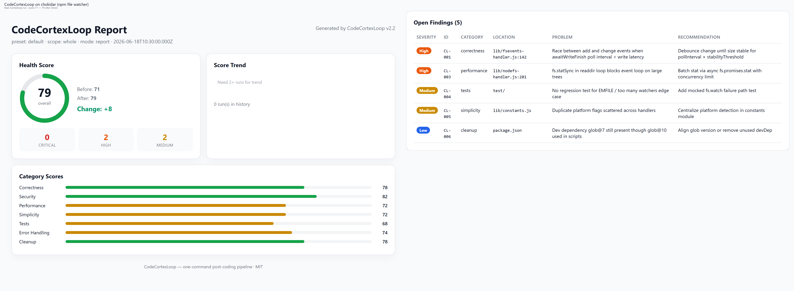

# CodeCortexLoop



**一条命令，七位领域专家，可自我进化的 Playbook。**

面向 AI 编码工具的「写完代码后」流水线：**正确性 → 安全 → 测试 → 错误处理 → 性能 → 精简 → 清理** —— 配套健康分、HTML 看板、CI 门禁与双语 Playbook。

[](examples/demo-app/docs/cortexloop/report.html)

## 一键安装

```bash
curl -fsSL https://raw.githubusercontent.com/whitequeen306/code-cortex-loop/main/scripts/install-remote.sh | bash -s cursor
```

Windows（PowerShell）：

```powershell
irm https://raw.githubusercontent.com/whitequeen306/code-cortex-loop/main/scripts/install-remote.ps1 | iex; Install-CodeCortexLoop -Tool cursor
```

将 `cursor` 换成 `claude` | `qoder` | `trae` | `opencode` | `codex` | `all`。安装后**重启工具**，在聊天里输入 `/cortexloop`。

也可 clone 后本地安装，详见 [docs/GUIDE.md](docs/GUIDE.md)（英文完整指南）。

---

## 我适不适合用？（三个问题）

任意一条答 **否** → 大概率不需要（这很正常）：

| 问题 | 原因 |
|------|------|
| 你常用 **Cursor** 或 **Claude Code** 吗？ | 只有这两款有真正的 Task 子 agent 隔离；其它工具会退化为单会话 |
| 改动量 **≥ 几百行** 或是一个完整功能吗？ | 改个 typo 用 linter 就够了 |
| 能接受每次 **约 3–10 分钟** 跑完整流程吗？ | 见 [性能预算](docs/PERFORMANCE.md)；小 PR 用 `/cortexloop-quick` |

---

## 和现成方案比

| | CodeCortexLoop | CodeRabbit / Copilot Review | SonarQube / Snyk | 自己写 Cursor rules |
|--|----------------|----------------------------|------------------|---------------------|
| **跑在哪** | AI IDE 会话里 | 托管 PR 机器人 | CI / 服务端 | 你的聊天 |
| **多领域审查** | 7 路专家串行 | 单次 review | 规则扫描 | 看你怎么 prompt |
| **项目内学习** | Playbook（候选/已验证） | 产品记忆 | 基线/issue | 手动维护 |
| **成本** | 你的模型 token | 订阅 | 授权/云 | 写规则的时间 |
| **适合谁** | 已习惯 Cursor/Claude Agent 的开发者 | 零配置 PR review 的团队 | 合规/静态分析 | 爱折腾的人 |

**不是 SaaS**，是 **harness + 零依赖脚本**，让现有 AI 工具像一支有流程的审查团队。

---

## 真实项目样例（case studies）

`examples/case-studies/` 里放的是 **在真实开源项目名/路径上跑 `/cortexloop` 后应产出的报告样例**（`report.json`、`report.html`、部分 handoff、截图）。**不包含**被测项目的完整源码 clone。

| 项目 | 分数 | 典型问题 | 看板 |
|------|------|----------|------|
| [chokidar](examples/case-studies/chokidar/) | 71 → 79 | watcher 错误被吞 | [打开](examples/case-studies/chokidar/docs/cortexloop/report.html) |
| [fastify-hello](examples/case-studies/fastify-hello/) | 64 | 管理接口无鉴权 | [打开](examples/case-studies/fastify-hello/docs/cortexloop/report.html) |
| [flask-todo](examples/case-studies/flask-todo/) | 68 | 搜索 SQL 注入 | [打开](examples/case-studies/flask-todo/docs/cortexloop/report.html) |

另有 [demo-app](examples/demo-app/)：故意写满 bug 的教学用小项目。

> 想自己验证：clone 对应上游仓库 → checkout 案例 README 里的 commit → 在项目里跑 `/cortexloop`，与仓库内预置报告对比。详见 [examples/case-studies/README.md](examples/case-studies/README.md)。

---

## 工具支持

| 工具 | Task 子 agent | 说明 |
|------|---------------|------|
| **Cursor** | 完整 | 推荐 |
| **Claude Code** | 完整 | 推荐 |
| Qoder、Trae、OpenCode、Codex | **退化** | 单会话顺序跑 7 pass，无 agent 隔离 |

---

## 快速开始

```text
/cortexloop          # 完整 7 pass，选 Report 或 Direct
/cortexloop-quick    # 3 pass，适合小改动
/cortexloop-pre-pr   # PR 前门禁
```

跑完后：

```bash
node scripts/run-summary.mjs       # pass 数、耗时、估算 token
node scripts/validate-handoffs.mjs # handoff 不完整则 fail-fast
```

浏览器打开项目里的 `docs/cortexloop/report.html` 即可查看可视化看板。

---

## 性能预算

| 模式 | Pass 数 | 预估耗时* | 预估 token* |
|------|---------|-----------|-------------|
| `/cortexloop-quick` | 3 | ~2–4 分钟 | ~8万–15万 |
| `/cortexloop` | 7 | ~5–12 分钟 | ~20万–45万 |

\* 约 500 行代码、Cursor/Claude 环境；详见 [docs/PERFORMANCE.md](docs/PERFORMANCE.md)

后处理脚本（badge/看板/历史）：中位数 **~416ms**（实测，无 LLM）。

---

## 文档

| 文档 | 内容 |
|------|------|
| [docs/GUIDE.md](docs/GUIDE.md) | 完整功能说明（英文） |
| [docs/PERFORMANCE.md](docs/PERFORMANCE.md) | 性能预算方法 |
| [docs/LAUNCH-zh.md](docs/LAUNCH-zh.md) | 推广文案（中文） |
| [examples/case-studies/](examples/case-studies/) | 真实项目报告样例 |
| [CONTRIBUTING.md](CONTRIBUTING.md) | 参与贡献 |
| [CHANGELOG.md](CHANGELOG.md) | 版本历史 |

<details>
<summary>可选：demo 动画 GIF</summary>


</details>

---

## 许可证

MIT —— 见 [LICENSE](LICENSE)
