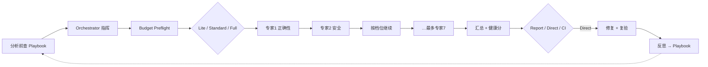

# CodeCortexLoop

**按风险花 token 的 AI 代码审查流水线。**

面向 AI 编码工具的「写完代码后」审查 harness：先做轻量预检，按变更风险推荐 **Lite / Standard / Full**，再调度对应专家。配套健康分、HTML 看板、handoff 接力、双语 Playbook、基线棘轮与 CI 集成。

[](examples/demo-app/docs/cortexloop/report.html)

## 快速上手

| 路径 | 命令 | 适合 | 你会得到 |
|------|------|------|----------|
| **Auto** | `/cortexloop` | 不确定该花多少 token | 预检风险 → 推荐 Lite / Standard / Full → 你确认后执行 |
| **Lite** | `/cortexloop-lite` | 小改动、第一次试用 | 3 pass 审查 → 打开 `docs/cortexloop/report.html` |
| **Standard** | `/cortexloop-standard` | 普通 PR、几百行改动 | 4 pass：正确性 + 安全 + 测试 + 错误处理 |
| **Full** | `/cortexloop-full` | 大 PR、上线前、高风险改动 | 7 pass 深审 → 可选 Direct 复验 → Playbook → CI 门禁 |

**Auto 路径：** 安装后重启 IDE → 在项目里输入 `/cortexloop` → 选择 **Report / Direct** 和范围 → 预检会根据变更文件、行数、敏感路径、测试信号推荐档位。Full 不再是默认 token 成本，除非你确认或配置指定。

**Lite 路径：** 输入 `/cortexloop-lite` → 选 **Report** → 跑完打开 [demo 看板](examples/demo-app/docs/cortexloop/report.html) 感受格式。不涉及 scope-map、Playbook、基线——后台仍会做必要落盘，你无需配置。

**Standard 路径：** 输入 `/cortexloop-standard`，直接跑普通 PR 最常用的 4 个专家：正确性、安全、测试、错误处理。

**Full 路径：** `/cortexloop-full` 完整七专家，适合大 PR、上线前或安全敏感改动。Direct 模式可自动修复并复验，经验写入 Playbook；`/cortexloop-pre-pr --ci` + GitHub Action 可做 PR 门禁。大仓库（>100 文件）自动启用 MAP，[详见 GUIDE](docs/GUIDE.md#大项目上下文工程)。

---

## 它怎么决定跑多深？

你在聊天里输入 `/cortexloop`，相当于请来一位**调度员**：它先问 **Report / Direct** 和审查范围，然后做 Budget Preflight，按变更文件、行数、敏感路径、测试信号等推荐 Lite / Standard / Full。用户确认后，调度员才按档位启动专家。

| 档位 | 专家 | 适合 |
|------|------|------|
| **Lite** | 正确性、安全、错误处理 | 小改动、第一次试用、token 敏感 |
| **Standard** | 正确性、安全、测试、错误处理 | 普通 PR、几百行改动 |
| **Full** | 7 位专家全量 | 大 PR、上线前、安全敏感、重构 |

Full 模式下会跑七位**分工明确的审查专家**（正确性、安全、测试、错误处理、性能、精简、清理）。调度员自己不做领域判断，而是负责排期、收报告、算健康分；真正看代码的是专家，各干各的领域，按顺序接力。

**第一次跑某个项目**，建议先用 **Report 模式**：只诊断、不改代码，你看完分数和报告再决定要不要修。

**整个流程可以概括成五段：**

**① 记住这次运行**  
每次执行都会按**本地时间**新建一份运行记录（例如「2026年6月25日 14:30」），报告放在独立文件夹里，不会盖掉你上次的结论。

**② 先建「该看哪里」的索引**  
工具先用 Git 弄清本次要审查哪些文件。项目很大（超过大约一百个文件）时，会再多做一步 **MAP**：像地图一样标出改动多、被大量引用、容易出问题的区域，让后面的专家**先盯重点**，而不是四百个文件盲目乱翻。索引和地图都写在磁盘上，不会把文件名塞进聊天窗口把 AI 撑爆。

**③ 按档位启动专家**  
Lite 跑 3 位，Standard 跑 4 位，Full 跑 7 位。每位专家只在独立会话里工作，读完前面专家的简要交接，再深入自己负责的那一类问题。大项目里会优先看 MAP 标出的热点，也会抽样扫一些「冷门」目录，避免只查热门文件夹。

**④ 出报告**  
汇总成健康分、分类说明和可打开的 HTML 看板。若选 **Direct 模式**，会按严重程度分批改代码、跑测试，改完再**重新审查一遍**确认没修坏、没漏修。

**⑤ 自进化，供下次使用**  
Direct 且复验通过后，工具会把**可复用的修复经验**写进项目内的 Playbook。下次再跑 `/cortexloop`，会**先翻翻以前验证过的套路**，再重新建索引、做 MAP、按档位审查——形成「越用越懂这个项目」的闭环。给人看的进化笔记追加在同一份日志里，不会每次清空。

**一句话：** 先预检风险和成本 → 你确认档位 → 专家按领域审查 → 报告归档 →（可选）自动修复并复验 → 经验写入 Playbook → 下次带着记忆再来。

---

## 核心能力

| 能力 | 说明 |
|------|------|
| **成本感知调度** | `/cortexloop` 先预检风险，再推荐 Lite / Standard / Full；Full 需要用户确认或配置指定 |
| **多专家串行** | Orchestrator 按档位调度 3 / 4 / 7 路独立专家（Cursor/Claude/OpenCode：`Task`；Qoder/Trae/Codex：见 [工具支持](#工具支持)） |
| **健康分 0–100** | 七维打分 + 总分；Direct 模式输出 **修复前 → 修复后** |
| **三种模式** | Report（只诊断）· Direct（修复+复验）· CI（门禁） |
| **Playbook** | 项目内学习修复模式（候选/已验证，防幻觉） |
| **CI/安装零额外依赖** | 后处理与门禁脚本仅需 Node，无需在用户项目 `npm install` |
| **大项目不断链** | 磁盘接力 + Map→Depth；>100 文件自动 MAP，小项目无感 → [GUIDE](docs/GUIDE.md#大项目上下文工程) |

---

<details>
<summary>大项目上下文工程（600+ 文件 / Pass 断链 → 展开摘要）</summary>

> **小项目无感：** scope 不足约 100 文件时不触发 MAP；聊天窗口只做调度，索引与 handoff 落盘。

解决 **「Pass 1 跑完、Pass 2 起不来」**：607 文件 inline 进 prompt 时调度层先于分析层崩溃。新模式是 **磁盘 = 接力总线**——orchestrator 只读 `handoff-summary.json` / `context-anchor.md`，专家在独立 Task 上下文里按需读 `scope-paths.json` 与 `scope-map.json`。

完整架构图、CortexScope Index 信号、L0/L1/codegraph 分层与相关脚本见 **[docs/GUIDE.md — 大项目上下文工程](docs/GUIDE.md#大项目上下文工程)**。

</details>

---

## 一键安装

```bash
curl -fsSL https://raw.githubusercontent.com/whitequeen306/code-cortex-loop/master/scripts/install-remote.sh | bash -s cursor
```

Windows（PowerShell）：

```powershell
irm https://raw.githubusercontent.com/whitequeen306/code-cortex-loop/master/scripts/install-remote.ps1 | iex; Install-CodeCortexLoop -Tool cursor
```

将 `cursor` 换成 `claude` | `qoder` | `trae` | `opencode` | `codex` | `all`。安装后**重启工具**，在聊天里输入 `/cortexloop`。

本地 clone 安装：

```powershell
git clone https://github.com/whitequeen306/code-cortex-loop.git
cd code-cortex-loop
.\scripts\install.ps1 -Tool cursor   # macOS/Linux: ./scripts/install.sh cursor
```

---

## 我适不适合用？（三个问题）

任意一条答 **否** → 大概率不需要（这很正常）：

| 问题 | 原因 |
|------|------|
| 你常用 **Cursor**、**Claude Code** 或 **OpenCode** 吗？ | 三者为一等公民（Task 完整）；其它工具见 [工具支持](#工具支持) |
| 改动量 **≥ 几百行** 或是一个完整功能吗？ | 改个 typo 用 linter；小改用 `/cortexloop-lite` |
| 能接受每次 **约 3–10 分钟** 跑完整流程吗？ | 见下方 [性能预算](#性能预算)；小 PR 用 `/cortexloop-lite` |

---

## 和现成方案比

| | CodeCortexLoop | CodeRabbit / Copilot Review | SonarQube / Snyk | 自己写 Cursor rules |
|--|----------------|----------------------------|------------------|---------------------|
| **跑在哪** | AI IDE 会话里 | 托管 PR 机器人 | CI / 服务端 | 你的聊天 |
| **多领域审查** | 按风险调度 3 / 4 / 7 路专家 | 单次 review | 规则扫描 | 看你怎么 prompt |
| **项目内学习** | Playbook（候选/已验证） | 产品记忆 | 基线/issue | 手动维护 |
| **成本** | 你的模型 token | 订阅 | 授权/云 | 写规则的时间 |
| **适合谁** | 已习惯 Cursor/Claude/Qoder Agent 的开发者 | 零配置 PR review 的团队 | 合规/静态分析 | 爱折腾的人 |

**不是 SaaS**，是 **harness + CI/安装零额外依赖的 Node 脚本**，让现有 AI 工具像一支有流程的审查团队。

---

## 怎么工作



- **Orchestrator**（主会话）：定 scope、做成本预检、按序委派专家、汇总 handoff、打分；**禁止**自己 inline 做 pass 分析
- **领域专家**（每 pass 一个独立子 agent）：只负责本领域，写类别报告 + handoff JSON，供下游专家阅读
  - **Cursor / Claude Code / OpenCode**：通过 `Task` 工具启动（OpenCode 需配置 `permission.task`）
  - **Qoder**：通过内置 `Agent` 工具委派 `~/.qoder/agents/` 中的自定义智能体（阻塞、独立上下文）
  - **Trae**：在 **SOLO 模式**下由 SOLO Coder 按顺序委派 `~/.trae/agents/` 中的 7 个自定义智能体
- **分析串行、修复串行**（Direct 模式下每组修复后跑测试）

### 专家固定顺序

Lite / Standard / Full 都从同一条顺序里裁剪：Lite 跑 1、2、4；Standard 跑 1、2、3、4；Full 跑全部 7 步。

| 步 | Pass | 专家 | 类别报告 | Handoff |
|----|------|-------------|----------|---------|
| 1 | `review` | `code-reviewer` | `01-correctness.md` | `.cortexloop/handoff/01-correctness.json` |
| 2 | `security` | `security-auditor` | `02-security.md` | `.cortexloop/handoff/02-security.json` |
| 3 | `tests` | `test-engineer` | `05-tests.md` | `.cortexloop/handoff/03-tests.json` |
| 4 | `errorHandling` | `silent-failure-hunter` | `06-error-handling.md` | `.cortexloop/handoff/04-error-handling.json` |
| 5 | `performance` | `performance-analyst` | `03-performance.md` | `.cortexloop/handoff/05-performance.json` |
| 6 | `simplicity` | `code-simplifier` | `04-simplicity.md` | `.cortexloop/handoff/06-simplicity.json` |
| 7 | `cleanup` | `cleanup-curator` | `07-cleanup.md` | `.cortexloop/handoff/07-cleanup.json` |

合约与边界：`passes/README.md` · Handoff Schema：`schemas/pass-handoff.schema.json`

---

## 三种工作模式

| 模式 | 触发 | 行为 |
|------|------|------|
| **Report** | `/cortexloop` 默认询问 | 写出报告 + 看板，**停下等你确认**再改代码 |
| **Direct** | 选择 Direct | 先确认档位和修复下限 → 分组修复 → 复验 → Playbook（见下表） |
| **CI** | `/cortexloop --ci` 或配置 `ci.enabled` | 无交互，写 `report.json`，跑 `ci-gate`，可选 PR 评论 |

**Direct 修复下限**（选 Direct 时询问；默认 **A. High+**）：

| 选项 | 自动修复 | 说明 |
|------|----------|------|
| **A. High+** | Critical + High | 推荐默认 |
| **B. Medium+** | + Medium | 功能收尾、愿意多改一点 |
| **C. 全量** | + Low | 改动面大，复验更耗时；Info 仍不自动修 |

配置：`direct.fixFloor` · CLI：`--fix-floor=High|Medium|Low`

---

## 命令一览

| 命令 | 用途 |
|------|------|
| `/cortexloop` | **智能入口**：询问 Report / Direct 与范围，预检风险并推荐 Lite / Standard / Full |
| `/cortexloop-lite` | **低成本**：3 pass，适合小改动和第一次试用 |
| `/cortexloop-standard` | **标准 PR 审查**：正确性 + 安全 + 测试 + 错误处理 |
| `/cortexloop-full` | **完整 7 pass**：适合大 PR、上线前、高风险改动 |
| `/cortexloop-security` | 安全 + 错误处理 + 依赖清理 |
| `/cortexloop-pre-pr` | PR 前：近期改动，High+ 须清零 |

高级命令：

| 命令 | 用途 |
|------|------|
| `/cortexloop-baseline` | 接受或对比技术债基线 |
| `/cortexloop-reflect` | 手动复盘并写入 Playbook |

兼容别名：`/cortexloop-quick` → `/cortexloop-lite`，`/cortexloop-deep` → `/cortexloop-full`。

---

## 跑完会得到什么

| 产物 | 路径 | 说明 |
|------|------|------|
| 概览 | `docs/cortexloop/00-summary.md` | 人类可读总结 + 健康分 |
| 分类报告 | `docs/cortexloop/01-*.md` … `07-*.md` | 各领域明细 |
| 机器报告 | `docs/cortexloop/report.json` | CI 门禁输入（须含 `"generatedBy":"cortexloop"`） |
| **HTML 看板** | `docs/cortexloop/report.html` | 浏览器直接打开，含分数环、类别条、问题表 |
| 运行统计 | `docs/cortexloop/run-summary.md` | pass 数、耗时、估算 token |
| Run Plan | `.cortexloop/run-plan.json` | 本次档位、风险分、启用/跳过 pass、成本等级 |
| Handoff | `.cortexloop/handoff/*.json` | 每 pass 结构化交接 |
| Scope 清单 | `.cortexloop/scope-manifest.json`、`.cortexloop/scope-paths.json` | 大 scope 按需读取，不进 prompt |
| 风险地图 | `.cortexloop/scope-map.json` | CortexScope Index 热点 + mustReview + longTailSample（>100 文件） |
| 上下文锚点 | `.cortexloop/context-anchor.md`、`.cortexloop/run-state.json` | orchestrator 瘦身调度 |
| Handoff 摘要 | `.cortexloop/handoff-summary.json` | 每 pass 压缩摘要 |
| 趋势 / 徽章 | `.cortexloop/history.json`、`.cortexloop/health-badge.svg` | README 可嵌入徽章 |
| Playbook | `.cortexloop/playbook.json` | 英文，**仅模型 query** |
| Playbook 中文 | `.cortexloop/playbook-zh.md` | 人类阅读，模型不读 |
| 复盘 | `docs/cortexloop/08-reflection.md` | Direct 成功后自动生成 |

`report.json` 写出后自动跑后处理（badge、看板、历史、PR 评论体）。也可手动：

```bash
node scripts/validate-handoffs.mjs --run-plan=.cortexloop/run-plan.json
node scripts/aggregate-findings.mjs --run-plan=.cortexloop/run-plan.json --orphans=.cortexloop/orphan-defers.json
node scripts/run-summary.mjs --run-plan=.cortexloop/run-plan.json --out=docs/cortexloop/run-summary.md
node scripts/make-dashboard.mjs docs/cortexloop/report.json
```

---

## 健康分（0–100）

按**未解决**问题扣分，Direct 模式展示 **修复前 → 修复后**：

| 严重度 | 扣分 |
|--------|------|
| Critical | -25 |
| High | -10 |
| Medium | -4 |
| Low | -1 |

每条计入分数的 finding 须含 **Evidence + Confidence**；低置信猜测不进计分，只进 Open Questions。

---

## Playbook 自我进化

v2.2 核心：**记忆是召回（去哪查），不是权威（该信什么）** —— 命中只提示优先排查区，修法每次重新推导验证。

| 层级 | 含义 |
|------|------|
| **verified** | 多样且已验证，query 默认展示 |
| **candidate** | 未确认假设，禁止自动套用 |
| **quarantined** | 失败/过低置信，不展示 |

```bash
# 分析前（默认仅 verified）
node scripts/playbook.mjs query --category=security,errorHandling --lang=js --global-merge

# Direct 复验成功后
node scripts/playbook.mjs record .cortexloop/reflection.json

# CI/人工确认或负反馈
node scripts/playbook.mjs feedback --signature=<sig> --outcome=external_verified --evidence="ci: run 123"
```

详见 [docs/GUIDE.md#自我进化learning-loop](docs/GUIDE.md) 与 `rules/learning-loop.mdc`。

---

## 工具支持

**一等公民（完整 Task 子 agent 隔离）：** Cursor · Claude Code · OpenCode

**社区 / 实验性（需额外配置，体验可能降级为单会话）：** Qoder · Trae · Codex

| 工具 | 安装参数 | 配置目录 | 子 agent |
|------|----------|----------|----------|
| **Cursor** | `cursor` | `~/.cursor/` | ✅ Task 完整 |
| **Claude Code** | `claude` | `~/.claude/` | ✅ Task 完整 |
| **OpenCode** | `opencode` | `~/.config/opencode/` | ✅ Task（需 `permission.task`；见 [adapters/opencode/](adapters/opencode/)） |
| **Qoder** | `qoder` | `~/.qoder/` | ⚡ Agent 工具（见 [adapters/qoder/](adapters/qoder/)） |
| **Trae** | `trae` | `~/.trae/` | ⚡ SOLO 模式（见 [adapters/trae/](adapters/trae/)） |
| **Codex** | `codex` | `~/.codex/` | ⚡ 显式 spawn（见 [adapters/codex/](adapters/codex/)） |

未配置子 agent 或用户确认时才会退化为单会话 fallback。OpenCode 与 Cursor 共用 Task 流程。各工具差异：[adapters/](adapters/)。

> **ZCode**（智谱 Z.ai ADE）是独立产品，与 Trae 不同，当前**未适配** CodeCortexLoop。

### Qoder 快速上手

1. 安装：`.\scripts\install-qoder.ps1`（或 `./scripts/install.sh qoder`），**重启 Qoder**
2. 确认 `~/.qoder/agents/` 下有 7 个专家（`code-reviewer.md` 等）
3. 在 **Agent 模式**聊天中运行 `/cortexloop`；主会话须启用 **Agent 工具**
4. Bootstrap 应显示 `✅ Qoder native subagent mode`；orchestrator 按 pass 顺序委派 7 专家
5. 若 Agent 工具不可用，可手动按顺序调用 `/code-reviewer` → … → `/cleanup-curator`

详见 [adapters/qoder/README.md](adapters/qoder/README.md)。

### Trae 快速上手（SOLO 模式）

1. 安装：`.\scripts\install-trae.ps1`（国内版目录为 `.trae-cn`），**重启 Trae**
2. **切换到 SOLO 模式**（左上角模式切换）
3. 在 SOLO Coder 设置中启用 7 个自定义智能体（来自 `~/.trae/agents/`）
4. 运行 `/cortexloop`；Bootstrap 应显示 `✅ Trae partial subagent mode`
5. SOLO Coder 按 pass 顺序委派专家；每步写 report + handoff JSON

普通 IDE 聊天（非 SOLO）会退化为单会话。详见 [adapters/trae/README.md](adapters/trae/README.md)。

### Codex 快速上手（显式 spawn）

1. 安装：`.\scripts\install-codex.ps1`（或 `./scripts/install.sh codex`），**重启 Codex**
2. 将 `~/.codex/codex.cortexloop.example.toml` 的 `[agents]` 合并进 `config.toml`（`max_depth = 1`）
3. 确认 `~/.codex/agents/` 下有 7 个 `.toml` 专家
4. 合并 `AGENTS.cortexloop.md` 到项目或用户的 `AGENTS.md`
5. 运行 `/prompts:cortexloop` 或明确要求：**按 pass 顺序逐个 spawn 子 agent**；Bootstrap 应显示 `✅ Codex partial subagent mode`
6. CLI 可用 `/agent` 查看子 agent 线程

Codex **不会自动 spawn**——必须在 prompt 里写清顺序。详见 [adapters/codex/README.md](adapters/codex/README.md)。

### OpenCode 快速上手

1. 安装：`.\scripts\install-opencode.ps1`，**重启 OpenCode**
2. 将 `~/.config/opencode/opencode.cortexloop.example.json` 中的 `permission.task` 合并进你的 `opencode.json`
3. 确认 `~/.config/opencode/agents/` 下 7 个专家含 `mode: subagent`
4. 用 **Build** 主 agent 运行 `/cortexloop` → Bootstrap 应显示 OpenCode Task 模式
5. 若 Task 被权限拒绝，可手动 `@code-reviewer` → … → `@cleanup-curator`

详见 [adapters/opencode/README.md](adapters/opencode/README.md)。

---

## 项目配置（可选）

日常用法可只复制最小配置；高级项见完整 example。

```bash
cp cortexloop.config.minimal.json cortexloop.config.json   # 推荐首次
# cp cortexloop.config.example.json cortexloop.config.json  # 全量参考（含 MAP/Playbook/CI 高级项）
cp .cortexloopignore.example .cortexloopignore
```

| 配置文件 | 用途 |
|----------|------|
| [cortexloop.config.minimal.json](cortexloop.config.minimal.json) | budget + scope + CI 开关——个人日常够用 |
| [cortexloop.config.example.json](cortexloop.config.example.json) | 全量参考：`mapWeights`、Playbook prune、crossValidation 等高级项 |

`cortexloop.config.json` 可覆盖 budget、scope、启用哪些 pass、CI 阈值、Playbook 路径等。行内抑制：`// cortexloop-ignore CL-001`。

---

## CI / GitHub Actions

第 1 步：你的 AI 工具产出 `docs/cortexloop/report.json`（例如 `/cortexloop-pre-pr --ci`）。

第 2 步：仓库根目录的复合 Action：

```yaml
name: CodeCortexLoop
on: [pull_request]

jobs:
  gate:
    runs-on: ubuntu-latest
    permissions:
      contents: read
      pull-requests: write
    steps:
      - uses: actions/checkout@v4
      # - run: your-ai-cli /cortexloop-pre-pr --ci
      - uses: whitequeen306/code-cortex-loop@v2.2.0
        with:
          report-path: docs/cortexloop/report.json
          max-high: '0'
          comment: 'true'
```

老项目债太多？先 `/cortexloop-baseline` 接受基线，再 `ci-gate --baseline` 只拦**新增** Critical/High。完整示例：[.github/workflows/cortexloop-example.yml](.github/workflows/cortexloop-example.yml)。

---

## 真实项目案例：LianYu-PC

[](examples/lianyu-pc/docs/cortexloop/showcase.html)

在 **Vue 3 + Spring Boot 全栈项目**上跑旧命令 `/cortexloop-deep`（现在等价于 `/cortexloop-full`）的 **Report 模式**（2026-06-22，整库扫描）。上图展示 **Report 诊断 → Direct 修复示意** 的先后对比；完整 81 条明细见标准看板。

| 阶段 | 健康分 | Critical / High / Medium / Low | 说明 |
|------|--------|--------------------------------|------|
| **Report 诊断** | **32** | 9 / 32 / 31 / 9 | 真实扫描产物 |
| **Direct 示意*** | **84** | 0 / 0 / 31 / 9 | 按 reflection 清零 Critical+High（41 项）后重算 |

\* Direct 右侧为**示意得分**（非完整七专家复验）；LianYu-PC 原项目有 `08-reflection.md` 记录修复，完整复验待重跑。

**典型发现：** 验证码表达式泄露 · SSE 错误仍持久化 · 前端轮询静默失败 · 认证/SSE 核心路径零测试

| 链接 | 说明 |
|------|------|
| [showcase.html](examples/lianyu-pc/docs/cortexloop/showcase.html) | **Report → Direct 对比看板**（上图来源） |
| [report.html](examples/lianyu-pc/docs/cortexloop/report.html) | 标准看板（含全部 finding 表） |
| [00-summary.md](examples/lianyu-pc/docs/cortexloop/00-summary.md) | 人类可读摘要 |
| [examples/lianyu-pc/](examples/lianyu-pc/) | 案例目录说明 |

> 产物为 Report 模式拷贝，**不含** LianYu-PC 源码，**未修改**原项目。  
> **想查看此项目：** [github.com/whitequeen306/LianYuPC](https://github.com/whitequeen306/LianYuPC)

### 教学用 Demo

[examples/demo-app/](examples/demo-app/) — 故意写满 bug 的小项目，适合第一次试 `/cortexloop`。

---

## 性能预算

| 模式 | Pass 数 | 预估耗时* | 预估 token* |
|------|---------|-----------|-------------|
| `/cortexloop-lite` | 3 | ~2–4 分钟 | ~8万–15万 |
| `/cortexloop-standard` | 4 | ~3–6 分钟 | ~12万–25万 |
| `/cortexloop-full` | 7 | ~5–12 分钟 | ~20万–45万 |
| `/cortexloop-full` + 整库 | 7 + 整库 | ~10–25 分钟 | ~40万–90万 |

\* 约 500 行 scope、Cursor/Claude；[详细方法 →](docs/PERFORMANCE.md)

后处理脚本（badge/看板/历史）：中位数 **~416ms**（实测，无 LLM）。

---

## 文档索引

| 文档 | 内容 |
|------|------|
| [docs/GUIDE.md](docs/GUIDE.md) | **完整指南（中文）**：基线棘轮、后处理、适配器、致谢 |
| [docs/PERFORMANCE.md](docs/PERFORMANCE.md) | 性能预算与测量 |
| [docs/LAUNCH-zh.md](docs/LAUNCH-zh.md) | 推广文案 |
| [passes/README.md](passes/README.md) | 七专家合约 |
| [CONTRIBUTING.md](CONTRIBUTING.md) | 参与贡献 |
| [CHANGELOG.md](CHANGELOG.md) | 版本历史 |

<details>
<summary>可选：demo 动画 GIF</summary>


</details>

---

## 仓库结构

```
commands/     # /cortexloop 系列 slash command
passes/       # 七专家串行合约
agents/       # 领域专家 persona
skills/       # cortexloop-expert-core（公共）+ 各领域 depth skill + reflect
rules/        # workflow、learning-loop、refactor-safety …
scripts/      # ci-gate、playbook、scope-manifest、compact-context、看板、安装脚本（CI/安装零额外依赖）
schemas/      # report、config、handoff JSON schema
examples/     # demo-app + lianyu-pc（真实大项目 Report）
action.yml    # GitHub 复合 Action
```

---

## 许可证

MIT —— 见 [LICENSE](LICENSE)
