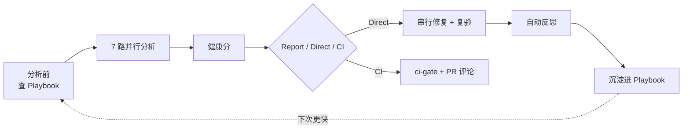
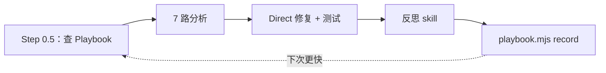

# CodeCortexLoop


**一条命令，跑完 7 路代码体检并自我进化。** 面向 AI 编码工具的"写完代码后"流水线：**审查、安全、测试、性能、精简、错误处理、清理** —— 配套健康分、趋势看板、基线棘轮、CI 集成，以及**可自我进化的修复记忆库（Playbook）**。

适配 **Cursor**、**Claude Code**、**Qoder**、**Trae**。

---

## 核心能力

| 能力 | 说明 |
|------|------|
| **一键 7 路体检** | `/cortexloop` 并行跑审查 / 安全 / 测试 / 性能 / 精简 / 错误处理 / 清理，只读分析、互不干扰 |
| **健康分（0–100）** | 按类别打分 + 总分，Direct 修复后给出 **修复前 → 修复后** 对比 |
| **可自我进化** ⭐ | 内置 **Playbook 记忆库**：分析前查"已验证修法"，Direct 修复后自动反思并沉淀经验，**越用越快、越用越准** |
| **可视化看板** | 自包含的 `report.html`，浏览器直接打开，无需起服务 |
| **趋势 + 徽章** | `history.json` 记录历次得分趋势，`health-badge.svg` 可嵌入仓库 README |
| **基线棘轮** | 老项目历史欠债一次性接受，CI 只对**新增**问题报错 |
| **CI / GitHub Action** | 内置复合 Action，一步完成门禁 + 徽章 + 看板 + PR 评论 |
| **零依赖** | 所有后处理脚本均为零 npm 依赖的纯 Node 脚本 |

> ⭐ **可自我进化**是 v2.2 的核心：CodeCortexLoop 把每次成功的修复抽象成"问题 → 修法"写入 Playbook；下次遇到同类问题，分析前先调出历史修法作为优先排查项。详见下文 [自我进化（Learning Loop）](#自我进化learning-loop)。



---

## 工作模式

输入 `/cortexloop`，CodeCortexLoop 跑完 **7 路只读分析**、汇总问题、算出健康分后，按你选择的模式产出：

- **Report 模式** —— 写出 `docs/cortexloop/*.md` + `report.json` + **HTML 看板**，停下等你确认
- **Direct 模式** —— 分组增量修复、逐组跑测试、**复验重扫**，给出修复前后得分与趋势，并**自动反思沉淀经验**
- **CI 模式** —— 机器可读报告 + 退出码 + 可选 PR 评论

---

## 安装

### 一键安装（按工具选择）

**Windows（PowerShell）：**
```powershell
git clone https://github.com/whitequeen306/code-cortex-loop.git
cd code-cortex-loop
.\scripts\install.ps1 -Tool cursor    # 或：claude | qoder | trae | all
```

**macOS / Linux：**
```bash
git clone https://github.com/whitequeen306/code-cortex-loop.git
cd code-cortex-loop
chmod +x scripts/install.sh
./scripts/install.sh cursor    # 或：claude | qoder | trae | all
```

安装脚本会把 `commands/`、`agents/`、`skills/`、`rules/`、`scripts/` 一并拷贝到对应工具的配置目录。装完**重启 IDE**，在聊天里输入 `/cortexloop` 即可。

---

## 不同智能体如何使用

各工具的命令名都一样（`/cortexloop` 系列），区别在于**安装目录**和**调用入口**。

### Cursor

1. 运行 `install.ps1 -Tool cursor`（或 `install.sh cursor`），文件装到 `~/.cursor/{commands,agents,skills,rules,scripts}/`。
2. 重启 Cursor。
3. 在 **Chat / Agent 面板**里直接输入 `/cortexloop`，按提示选 Report / Direct 与范围。
4. 也可用插件清单 `.cursor-plugin/plugin.json` 以插件方式加载。

### Claude Code

1. 运行 `install.ps1 -Tool claude`（或 `install.sh claude`），文件装到 `~/.claude/{commands,agents,skills,scripts}/`，并把 `AGENTS.md` 拷为 `~/.claude/AGENTS.cortexloop.md` 供参考。
2. 在 Claude Code 会话中输入 `/cortexloop`。
3. 或用插件：`claude plugin install .`（在仓库根目录，清单见 `.claude-plugin/plugin.json`）。
4. 建议把 `AGENTS.cortexloop.md` 的规则按需并入你项目的 `AGENTS.md`。

### Qoder

1. 运行 `install.ps1 -Tool qoder`（或 `install.sh qoder`），文件装到 `~/.qoder/{commands,agents,skills,rules,scripts}/`。
2. 重启 Qoder，输入 `/cortexloop`。
3. 细节见 [adapters/qoder](adapters/qoder/README.md)。

### Trae

1. 运行 `install.ps1 -Tool trae`（默认 user 作用域，装到 `~/.trae/`）；项目级可用 `install-trae.ps1 -Scope project`，装到当前项目的 `.trae/`。
2. 重启 Trae，输入 `/cortexloop`。
3. 细节见 [adapters/trae](adapters/trae/README.md)。

> **关于脚本路径**：`/cortexloop` 流程会调用 `node scripts/*.mjs` 做后处理（看板 / 徽章 / Playbook 等）。从 **clone 的仓库根目录**运行最稳妥；在你自己的项目里运行时，请确保 `scripts/` 可访问（已随安装拷贝到工具配置目录），或直接用本仓库根目录执行脚本。CI 场景由 `action.yml` 自动定位脚本，无需关心路径。

---

## 命令

| 命令 | 用途 |
|------|------|
| `/cortexloop` | 完整流水线；会询问 Report / Direct 及范围 |
| `/cortexloop-quick` | 仅审查 + 安全 + 错误处理，针对近期改动（High+） |
| `/cortexloop-deep` | 全部 7 路、整库扫描、强制基准测试 |
| `/cortexloop-security` | 安全 + 错误处理 + 依赖审计 |
| `/cortexloop-pre-pr` | PR 前门禁：近期改动，High+ 必须清零 |
| `/cortexloop-baseline` | 接受或对比技术债基线 |
| `/cortexloop-reflect` | 手动反思并把经验写入 Playbook |

加 `--ci` 进入 CI 模式（无交互、写 JSON、跑门禁）。

---

## 自我进化（Learning Loop）

v2.2 引入 **Playbook 记忆库** —— 沉淀已验证的"问题 → 修法"，让 agent 在重复问题上越来越快、越来越准。



**架构原则**：AI 只产出结构化 JSON，确定性的活（去重 / 计数 / 置信度 / 剪枝 / 合并）全交给零依赖 Node 脚本；也不会把整本 Playbook 塞进上下文，而是用脚本预筛出相关切片。

### 分析前 —— 查询（query）

```bash
node scripts/playbook.mjs query --category=performance,simplicity,errorHandling --lang=js --global-merge
```

输出相关修法（签名、问题、修法、置信度、命中次数）。**命中只是建议**，不跳过分析、不盲目套用，套用后仍走 refactor-safety + 测试验证。

### Direct 修复后 —— 反思并记录（record）

Direct 模式会**自动**运行反思 skill，产出 `docs/cortexloop/08-reflection.md`（人类可读复盘）与 `.cortexloop/reflection.json`（结构化条目），随后：

```bash
node scripts/playbook.mjs record .cortexloop/reflection.json
# 可选：--global 同时写入 ~/.cortexloop/playbook.json
```

手动触发：`/cortexloop-reflect`

### 置信度与排序

| 事件 | 效果 |
|------|------|
| 新建条目 | `confidence = 0.5`，`appliedCount = 1` |
| 再次命中 / 记录 | `appliedCount++`，`confidence = min(0.95, +0.1)` |
| 低于阈值 | 被 prune 剪除 |

查询排序：`confidence × log(appliedCount + 1)` 降序。

### 存储：项目级 vs 全局

| 位置 | 路径 | 用途 |
|------|------|------|
| **项目级**（默认） | `.cortexloop/playbook.json` | 提交进 repo —— 团队共享记忆 |
| **全局**（可选） | `~/.cortexloop/playbook.json` | 个人跨项目记忆 |

`query --global-merge` 会把全局合并进项目视图（同签名以项目条目为准）。示例记忆库见 [examples/demo-app/.cortexloop/playbook.json](examples/demo-app/.cortexloop/playbook.json)。

### 策展 —— 剪枝（prune）

```bash
node scripts/playbook.mjs prune --min-confidence=0.3 --max-age-days=180 --max-entries=200
```

> **重要**：Playbook 命中是**建议而非强制**。每条被采纳的修法仍要经过 refactor-safety 规则与测试验证。详见 `rules/learning-loop.mdc`。

---

## 7 路分析

| 路 | Agent / Skill | 关注点 |
|----|---------------|--------|
| 审查 | `code-reviewer` | 正确性、可读性、架构 |
| 安全 | `security-auditor` | OWASP、密钥、鉴权、注入 |
| 测试 | `test-engineer` | 覆盖盲区、弱测试 |
| 性能 | `performance-optimization` | N+1、基准、重渲染 |
| 精简 | `code-simplifier` | 不改行为的清晰化 |
| 错误处理 | `silent-failure-hunter` | 静默失败、过宽 catch |
| 清理 | `dead-code-and-deps` | 死代码、有漏洞的依赖 |

**分析并行（只读），修复串行（每组之间跑测试）。**

---

## 健康分

每个类别 0–100，按未解决问题扣分：

| 严重度 | 扣分 |
|--------|------|
| Critical | -25 |
| High | -10 |
| Medium | -4 |
| Low | -1 |

Direct 模式在总结里给出 **修复前 → 修复后**，历史记录则跨次追踪趋势。

---

## 输出预览

跑完 `/cortexloop`，你得到的是**可视化报告**，而不只是一堆文本文件。

### HTML 看板（`report.html`）

由 `make-dashboard.mjs` 生成的自包含页面，任意浏览器直接打开，无需起服务。

[](examples/demo-app/docs/cortexloop/report.html)

| 面板 | 内容 |
|------|------|
| **健康分** | 总分 0–100 环形图 + Critical / High / Medium 计数 |
| **得分趋势** | 来自 `history.json` 的迷你折线（Direct 修复后上升） |
| **类别得分** | 7 条：正确性、安全、性能、精简、测试、错误处理、清理 |
| **未解决问题** | 可排序表格 —— 严重度徽章、`CL-###`、位置、问题、建议 |

**试一试**：clone 后打开 [examples/demo-app/docs/cortexloop/report.html](examples/demo-app/docs/cortexloop/report.html)

### README 徽章（`health-badge.svg`）

嵌入你的仓库 README，每次运行自动更新：

```markdown

```

当前 demo 得分：**58/100**（见本页顶部徽章）。

### PR 评论（GitHub）

CI 中 CodeCortexLoop 会在 PR 上发汇总评论：类别得分表、Top 问题列表、看板链接。示例见 [demo PR 评论正文](examples/demo-app/.cortexloop/pr-comment.md)。

### Markdown + JSON 报告

| 文件 | 格式 | 用途 |
|------|------|------|
| `docs/cortexloop/00-summary.md` | Markdown | 人类可读概览 |
| `docs/cortexloop/01-correctness.md` … `07-cleanup.md` | Markdown | 各类别明细 |
| `docs/cortexloop/report.json` | JSON | CI 门禁、脚本、集成 |
| `docs/cortexloop/report.html` | HTML | 可视化看板（见上） |

样例机器报告：[examples/demo-app/docs/cortexloop/report.json](examples/demo-app/docs/cortexloop/report.json)

---

## 后处理脚本

`report.json` 写出后运行（零 npm 依赖）：

```bash
node scripts/record-history.mjs docs/cortexloop/report.json
node scripts/make-badge.mjs docs/cortexloop/report.json
node scripts/make-dashboard.mjs docs/cortexloop/report.json
node scripts/pr-comment.mjs docs/cortexloop/report.json
node scripts/playbook.mjs query --category=performance,simplicity,errorHandling --lang=js
node scripts/playbook.mjs record .cortexloop/reflection.json
node scripts/playbook.mjs prune
```

配置开启后（默认开启），`/cortexloop` 会自动执行这些。

---

## 基线棘轮（老项目）

历史问题太多？先一次性接受当前欠债：

```bash
/cortexloop-baseline   # 或：
node scripts/baseline.mjs accept docs/cortexloop/report.json
```

之后每个 PR：

```bash
node scripts/baseline.mjs diff docs/cortexloop/report.json
node scripts/ci-gate.mjs docs/cortexloop/report.json --baseline
```

只有**新增**的 Critical/High 会让 CI 失败，已修复的问题计为进步。

---

## 项目配置

把示例拷进项目根目录：

```bash
cp cortexloop.config.example.json cortexloop.config.json
cp .cortexloopignore.example .cortexloopignore
```

### `cortexloop.config.json`（关键字段）

```json
{
  "preset": "pre-pr",
  "scope": "recent",
  "severityFloor": "High",
  "ci": {
    "enabled": true,
    "sarif": true,
    "failOnCritical": true,
    "maxHigh": 0,
    "baseline": false
  },
  "history": { "enabled": true },
  "badge": { "enabled": true },
  "dashboard": { "enabled": true },
  "baseline": { "enabled": false },
  "learning": {
    "enabled": true,
    "playbookPath": ".cortexloop/playbook.json",
    "global": false,
    "reflectOn": "direct",
    "prune": { "minConfidence": 0.3, "maxAgeDays": 180, "maxEntries": 200 }
  }
}
```

### 抑制误报

**文件级**（`.cortexloopignore`）：
```
dist/
*.min.js
```

**行内：**
```typescript
// cortexloop-ignore CL-042
legacyFallback();
```

---

## CI / GitHub Actions

CodeCortexLoop 在仓库根目录提供**复合 GitHub Action**（`action.yml`）。

### 最小工作流

```yaml
name: CodeCortexLoop
on: [pull_request]

jobs:
  cortexloop:
    runs-on: ubuntu-latest
    permissions:
      contents: read
      pull-requests: write
    steps:
      - uses: actions/checkout@v4

      # 第 1 步：你的 AI 工具产出 report.json
      # - run: your-ai-cli /cortexloop-pre-pr --ci

      # 第 2 步：门禁 + 徽章 + 看板 + PR 评论
      - uses: whitequeen306/code-cortex-loop@v2.2.0
        with:
          report-path: docs/cortexloop/report.json
          max-high: '0'
          baseline: 'false'
          comment: 'true'
```

完整示例见 [.github/workflows/cortexloop-example.yml](.github/workflows/cortexloop-example.yml)。

### 手动门禁

```bash
node scripts/ci-gate.mjs docs/cortexloop/report.json
node scripts/ci-gate.mjs docs/cortexloop/report.json --baseline   # 棘轮模式
```

| 退出码 | 含义 |
|--------|------|
| `0` | 通过 |
| `1` | 存在 Critical |
| `2` | High 超过阈值 |
| `3` | 报告缺失或无效 |

---

## 输出产物

| 文件 | 说明 |
|------|------|
| `docs/cortexloop/00-summary.md` | 概览 + 健康分 |
| `docs/cortexloop/01-correctness.md` … `07-cleanup.md` | 各类别问题 |
| `docs/cortexloop/report.json` | 机器可读（schema 见 `schemas/`） |
| `docs/cortexloop/report.html` | **可视化看板** |
| `docs/cortexloop/report.sarif` | SARIF，用于 GitHub 代码扫描（可选） |
| `docs/cortexloop/08-reflection.md` | Direct 后的人类可读复盘 |
| `.cortexloop/history.json` | 得分趋势历史 |
| `.cortexloop/health-badge.svg` | README 徽章 |
| `.cortexloop/baseline.json` | 已接受的欠债快照 |
| `.cortexloop/pr-comment.md` | GitHub PR 评论正文 |
| `.cortexloop/playbook.json` | **自我进化的修复记忆库** |
| `.cortexloop/reflection.json` | 最近一次反思（record 的输入） |

每条问题包含：`CL-001`、严重度、类别、位置、问题、建议、是否可自动修复。

---

## Demo 演示

见 [examples/README.md](examples/README.md) —— 含一个故意写满 bug 的应用，以及预生成的看板 / 徽章 / 历史 / Playbook。

```bash
cd examples/demo-app
# 浏览器打开 docs/cortexloop/report.html
/cortexloop    # 用你的 AI 工具运行
```

---

## 仓库结构

```
cortexloop/
├── commands/           # /cortexloop, /cortexloop-quick, /cortexloop-reflect, ...
├── agents/             # code-reviewer, security-auditor, ...
├── skills/             # performance, simplify, reflect, ...
├── rules/              # workflow, refactor-safety, learning-loop, ...
├── scripts/            # install.*, ci-gate, baseline, playbook, make-dashboard, ...
├── schemas/            # report + config JSON schema
├── examples/           # demo 应用 + 演示
├── action.yml          # GitHub 复合 Action
├── adapters/           # Qoder & Trae 安装说明
├── .cursor-plugin/     # Cursor 清单
├── .claude-plugin/     # Claude Code 清单
├── AGENTS.md           # 跨工具规则
└── cortexloop.config.example.json
```

---

## 致谢

- [superpowers](https://github.com/obra/superpowers) —— 插件结构灵感
- [Anthropic claude-plugins-official](https://github.com/anthropics/claude-plugins-official) —— code-simplifier、silent-failure-hunter
- [performance-deity](https://github.com/v0idOS/performance-deity) —— 基准测试方法（MIT）

---

## 许可证

MIT —— 见 [LICENSE](LICENSE)
