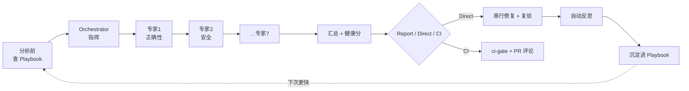
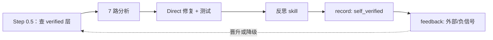
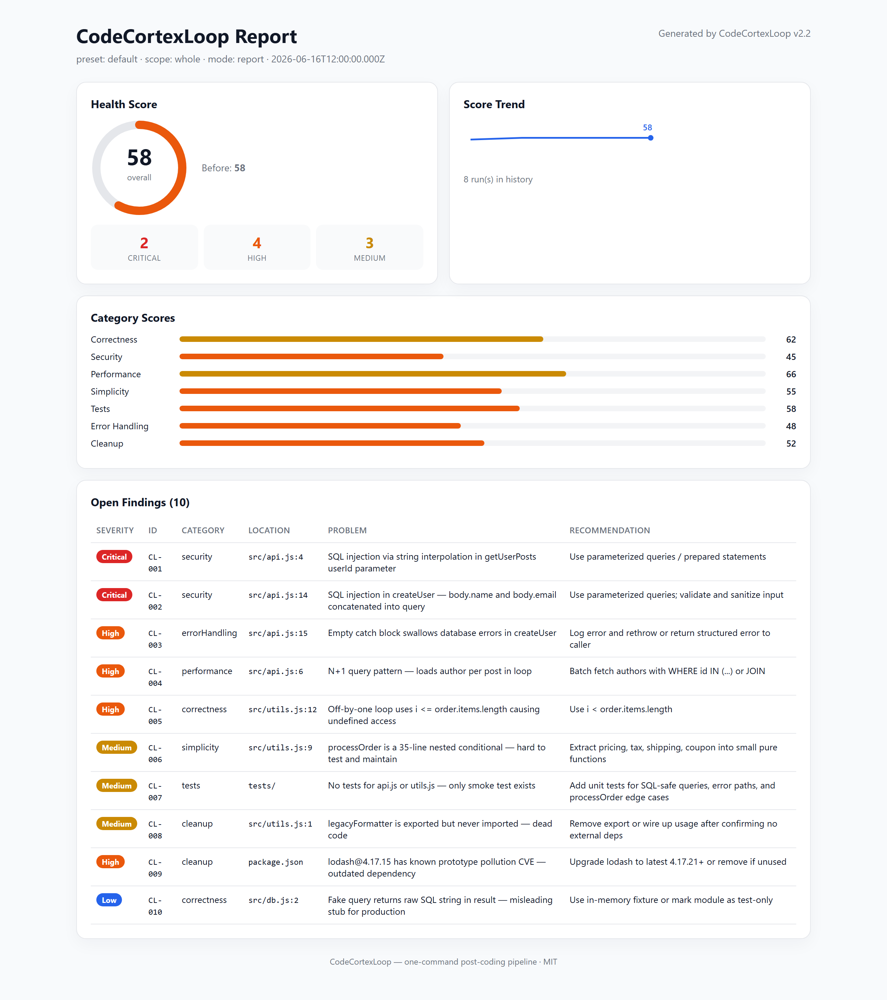

# CodeCortexLoop


**一条命令，跑完 7 路代码体检并自我进化。** 面向 AI 编码工具的"写完代码后"流水线：**审查、安全、测试、性能、精简、错误处理、清理** —— 配套健康分、趋势看板、基线棘轮、CI 集成，以及**可自我进化的修复记忆库（Playbook）**。

适配 **Cursor**、**Claude Code**、**Qoder**、**Trae**、**OpenCode**、**Codex**。

| 工具 | 安装参数 | 配置目录 | 调用方式 |
|------|----------|----------|----------|
| **Cursor** | `cursor` | `~/.cursor/` | `/cortexloop` |
| **Claude Code** | `claude` | `~/.claude/` | `/cortexloop` |
| **Qoder** | `qoder` | `~/.qoder/` | `/cortexloop` |
| **Trae** | `trae` | `~/.trae/` 或项目 `.trae/` | `/cortexloop` |
| **OpenCode** | `opencode` | `~/.config/opencode/` | TUI 输入 `/cortexloop` |
| **Codex** | `codex` | `~/.codex/` 或 `$CODEX_HOME` | skills / AGENTS（见下文） |

> Codex 目前不保证原生顶层 `/cortexloop`；推荐用 skills 或自然语言触发。OpenCode 与 Cursor 一样支持 slash command。

---

## 核心能力

| 能力 | 说明 |
|------|------|
| **七专家串行协作** | `/cortexloop` 按固定顺序启动 7 个领域专家（Task 子 agent），每人只负责本领域；orchestrator 只调度与汇总，不 inline 分析 |
| **健康分（0–100）** | 按类别打分 + 总分，Direct 修复后给出 **修复前 → 修复后** 对比 |
| **可自我进化** ⭐ | 内置 **Playbook 记忆库**（**防幻觉信任模型**：两层候选/已验证、验证驱动置信度、负信号、外部预言机优先）；分析前查已验证线索，Direct 后反思沉淀 |
| **可视化看板** | 自包含的 `report.html`，浏览器直接打开，无需起服务 |
| **趋势 + 徽章** | `history.json` 记录历次得分趋势，`health-badge.svg` 可嵌入仓库 README |
| **基线棘轮** | 老项目历史欠债一次性接受，CI 只对**新增**问题报错 |
| **CI / GitHub Action** | 内置复合 Action，一步完成门禁 + 徽章 + 看板 + PR 评论 |
| **零依赖** | 所有后处理脚本均为零 npm 依赖的纯 Node 脚本 |

> ⭐ **可自我进化**是 v2.2 的核心：记忆是**召回（去哪看）**而非**权威（该信什么）**——命中只提示优先排查区，修法每次重新推导验证。带两层信任模型（候选/已验证）、验证驱动置信度（含负信号）、外部预言机优先、多样性晋升与时间衰减，防止"越记越幻觉"。详见 [自我进化（Learning Loop）](#自我进化learning-loop)。



---

## 工作模式

输入 `/cortexloop`，CodeCortexLoop 跑完 **7 路只读分析**、汇总问题、算出健康分后，按你选择的模式产出：

- **Report 模式** —— 写出 `docs/cortexloop/*.md` + `report.json` + **HTML 看板**，停下等你确认
- **Direct 模式** —— 分组增量修复、逐组跑测试、**复验重扫**，给出修复前后得分与趋势，并**自动反思沉淀经验**
- **CI 模式** —— 机器可读报告 + 退出码 + 可选 PR 评论

---

## 安装

### 一键安装（按工具选择）

```powershell
# Windows — 把 cursor 换成：claude | qoder | trae | opencode | codex | all
git clone https://github.com/whitequeen306/code-cortex-loop.git
cd code-cortex-loop
.\scripts\install.ps1 -Tool cursor
```

```bash
# macOS / Linux — 把 cursor 换成：claude | qoder | trae | opencode | codex | all
git clone https://github.com/whitequeen306/code-cortex-loop.git
cd code-cortex-loop
chmod +x scripts/install.sh
./scripts/install.sh cursor
```

安装脚本会把 `commands/`、`agents/`、`passes/`、`skills/`、`rules/`、`scripts/` 拷贝到对应工具的配置目录（Codex 拷贝 skills/scripts/passes/prompts，见 [adapters/codex](adapters/codex/README.md)）。

装完后 **重启对应工具**，在 Cursor / Claude / Qoder / Trae / OpenCode 中输入 `/cortexloop`；Codex 见下方专门说明。

### 支持的 AI 编码工具

| 工具 | 一键安装 | 用户级配置目录 | 怎么用 |
|------|----------|----------------|--------|
| Cursor | `install.ps1 -Tool cursor` | `~/.cursor/` | Chat 里 `/cortexloop` |
| Claude Code | `-Tool claude` | `~/.claude/` | 会话里 `/cortexloop` |
| Qoder | `-Tool qoder` | `~/.qoder/` | 聊天里 `/cortexloop` |
| Trae | `-Tool trae` | `~/.trae/` | 聊天里 `/cortexloop` |
| OpenCode | `-Tool opencode` | `~/.config/opencode/` | TUI 里 `/cortexloop` |
| Codex | `-Tool codex` | `~/.codex/` | `/skills` 或 “Use CodeCortexLoop…” |
| 全部 | `-Tool all` | 以上全部 | 按各工具分别重启后使用 |

各工具详细路径与差异见 [adapters/](adapters/)。

---

## 不同智能体如何使用

**Slash command 工具**（Cursor / Claude / Qoder / Trae / OpenCode）：命令名一致，都是 `/cortexloop` 系列。

**Codex**：走 skills + `AGENTS.md`；可选 deprecated 的 `/prompts:cortexloop`。

### Cursor

1. 运行 `install.ps1 -Tool cursor`（或 `install.sh cursor`），文件装到 `~/.cursor/{commands,agents,skills,rules,scripts}/`。
2. 重启 Cursor。
3. 在 **Chat / Agent 面板**里直接输入 `/cortexloop`，按提示选 Report / Direct 与范围。
4. 也可用插件清单 `.cursor-plugin/plugin.json` 以插件方式加载。

### Claude Code

1. 运行 `install.ps1 -Tool claude`（或 `install.sh claude`），文件装到 `~/.claude/{commands,agents,skills,scripts}/`，并把 `AGENTS.md` 拷为 `~/.claude/AGENTS.cortexloop.md` 供参考。
2. 在 Claude Code 会话中输入 `/cortexloop`。
3. 或用插件：`claude plugin install .`（在仓库根目录，清单见 `.claude-plugin/plugin.json`）。
4. 建议把 `AGENTS.cortexloop.md` 的规则按需并入你项目的 `AGENTS.md`。

### Qoder

1. 运行 `install.ps1 -Tool qoder`（或 `install.sh qoder`），文件装到 `~/.qoder/{commands,agents,skills,rules,scripts}/`。
2. 重启 Qoder，输入 `/cortexloop`。
3. 细节见 [adapters/qoder](adapters/qoder/README.md)。

### Trae

1. 运行 `install.ps1 -Tool trae`（默认 user 作用域，装到 `~/.trae/`）；项目级可用 `install-trae.ps1 -Scope project`，装到当前项目的 `.trae/`。
2. 重启 Trae，输入 `/cortexloop`。
3. 细节见 [adapters/trae](adapters/trae/README.md)。

### OpenCode

1. 运行 `install.ps1 -Tool opencode`（或 `install.sh opencode`），文件装到 `~/.config/opencode/{commands,agents,skills,rules,scripts}/`。
2. 重启 OpenCode。
3. 在 OpenCode TUI 里输入 `/cortexloop`。
4. 细节见 [adapters/opencode](adapters/opencode/README.md)。

### Codex

1. 运行 `install.ps1 -Tool codex`（或 `install.sh codex`），文件装到 `~/.codex/`；如果设置了 `CODEX_HOME`，则安装到 `$CODEX_HOME`。
2. 重启 Codex。
3. 推荐使用 skills/AGENTS 方式：输入“Use CodeCortexLoop to review this project”或在 `/skills` 中选择相关 skill。
4. 可选旧式 prompt 快捷方式：`/prompts:cortexloop`（Codex custom prompts 已被官方标为 deprecated）。
5. 细节见 [adapters/codex](adapters/codex/README.md)。

> **关于脚本路径**：`/cortexloop` 流程会调用 `node scripts/*.mjs` 做后处理（看板 / 徽章 / Playbook 等）。从 **clone 的仓库根目录**运行最稳妥；在你自己的项目里运行时，请确保 `scripts/` 可访问（已随安装拷贝到工具配置目录），或直接用本仓库根目录执行脚本。CI 场景由 `action.yml` 自动定位脚本，无需关心路径。

---

## 命令

| 命令 | 用途 |
|------|------|
| `/cortexloop` | 完整流水线；会询问 Report / Direct 及范围 |
| `/cortexloop-quick` | 仅审查 + 安全 + 错误处理，针对近期改动（High+） |
| `/cortexloop-deep` | 全部 7 路、整库扫描、强制基准测试 |
| `/cortexloop-security` | 安全 + 错误处理 + 依赖审计 |
| `/cortexloop-pre-pr` | PR 前门禁：近期改动，High+ 必须清零 |
| `/cortexloop-baseline` | 接受或对比技术债基线 |
| `/cortexloop-reflect` | 手动反思并把经验写入 Playbook |

加 `--ci` 进入 CI 模式（无交互、写 JSON、跑门禁）。

---

## 自我进化（Learning Loop）

v2.2 引入 **Playbook 记忆库**，在保留"省 token 召回"收益的同时，用**防幻觉信任模型**阻断回音壁（模型把自己的产物当成 ground truth 越记越自信）。

**核心权衡**：记忆告诉你**去哪查**，不告诉你**该信什么**——每次命中仍重新推导、重新验证，绝不从记忆直接粘贴修法。



**架构原则**：AI 只产出结构化 JSON；确定性活（去重 / 两层 / 置信度 / 负信号 / 衰减 / 剪枝）全交给零依赖 Node 脚本；脚本**不读 config**，用 CLI flag + 内置默认值。

### 两层信任

| 层级 | 含义 | query 行为 |
|------|------|------------|
| **verified** | 多样且已验证的可信召回 | 默认展示 |
| **candidate** | 未确认假设 | 仅 `--include-candidates` 展示，标注为**猜测，禁止套用** |
| **quarantined** | 失败/过低置信 | 不展示，可 `--drop-quarantined` 剪枝 |

晋升条件：`confidence >= 0.7` 且 `verifiedCount >= 2` 且 `distinctContexts >= 2`（跨场景验证，非同一文件反复命中）。

### 分析前 —— 查询（query，默认 verified-only）

```bash
node scripts/playbook.mjs query --category=performance,simplicity,errorHandling --lang=js --global-merge
# 查看未确认候选（标注为猜测，禁止套用）：
node scripts/playbook.mjs query ... --include-candidates
```

输出是**优先排查线索**，不是可直接套用的修法。套用后仍走 refactor-safety + 测试。

### Direct 修复后 —— 反思并记录（record）

Direct 模式自动运行反思 skill，产出 `08-reflection.md` 与 `reflection.json`，随后：

```bash
node scripts/playbook.mjs record .cortexloop/reflection.json
# 可选：--global 同时写入 ~/.cortexloop/playbook.json
# 同时自动生成 .cortexloop/playbook-zh.md（中文阅读，模型不读）
# 仅重新导出中文：node scripts/playbook.mjs export-zh
```

`record` 应用 `self_verified`（+0.1）。**新条目从 candidate 起步**（confidence 0.3→0.4），不会自动进入 verified。

`reflection.json` 每条需含 **英文**（`problemPattern` / `fixMethod`，供模型 query）与 **中文**（`problemPatternZh` / `fixMethodZh`，供 `playbook-zh.md`）。

手动触发：`/cortexloop-reflect`

### 反馈信号（feedback）—— 外部预言机 + 负信号

置信度**只在已验证结果上移动**，负信号强于正信号：

| 结果 | 置信度变化 | 何时使用 |
|------|------------|----------|
| `external_verified` | +0.2 | CI 通过 / PR 合并 / 人工确认 |
| `self_verified` | +0.1 | Direct 复验 + 本地测试通过（record） |
| `rejected` | -0.1 | 推荐但判定不适用 |
| `failed` | -0.4 | 应用后测试挂 / 被回滚 |

```bash
# CI / 人工确认
node scripts/playbook.mjs feedback --signature=<sig> --outcome=external_verified --evidence="ci: run 123"

# 推荐不适用
node scripts/playbook.mjs feedback --signature=<sig> --outcome=rejected

# 修复失败 / 回滚
node scripts/playbook.mjs feedback --signature=<sig> --outcome=failed
```

外部信号（CI/人工）权重 > 自报成功。**不在 action.yml 中自动调用**（CI 无法知道具体 signature）。

### 信任衰减

未再次验证的记忆按 `0.01/天` 衰减有效置信度；`lastValidated` 在 verified 结果时重置。

查询排序：`decayedConfidence × log(verifiedCount+1) × tierWeight × failPenalty`。

### 存储：项目级 vs 全局

| 位置 | 路径 | 用途 |
|------|------|------|
| **项目级**（默认） | `.cortexloop/playbook.json` | 提交进 repo —— 团队共享记忆（**英文，仅模型 query**） |
| **全局**（可选） | `~/.cortexloop/playbook.json` | 个人跨项目记忆（英文，模型 query） |
| **中文阅读** | `.cortexloop/playbook-zh.md` | `record` / `feedback` / `prune` 后自动生成，**不**参与 query |

示例见 [examples/demo-app/.cortexloop/playbook.json](examples/demo-app/.cortexloop/playbook.json)（含 verified + candidate 混合样例）。

### 策展 —— 剪枝（prune）

```bash
node scripts/playbook.mjs prune --min-confidence=0.3 --max-age-days=180 --max-entries=200
node scripts/playbook.mjs prune --drop-quarantined
```

按**衰减后**置信度剪枝。

> **重要**：Playbook 是**召回而非权威**。候选层禁止自动套用；负信号必须如实回写。详见 `rules/learning-loop.mdc`。

---

## 7 路分析

| 路 | Agent / Skill | 关注点 |
|----|---------------|--------|
| 审查 | `code-reviewer` | 正确性、可读性、架构 |
| 安全 | `security-auditor` | OWASP、密钥、鉴权、注入 |
| 测试 | `test-engineer` | 覆盖盲区、弱测试 |
| 性能 | `performance-optimization` | N+1、基准、重渲染 |
| 精简 | `code-simplifier` | 不改行为的清晰化 |
| 错误处理 | `silent-failure-hunter` | 静默失败、过宽 catch |
| 清理 | `dead-code-and-deps` | 死代码、有漏洞的依赖 |

**分析串行（七专家 Task 接力，只读），修复串行（每组之间跑测试）。** Orchestrator 禁止 inline 分析 —— 详见 `passes/README.md`。

---

## 健康分

每个类别 0–100，按未解决问题扣分：

| 严重度 | 扣分 |
|--------|------|
| Critical | -25 |
| High | -10 |
| Medium | -4 |
| Low | -1 |

Direct 模式在总结里给出 **修复前 → 修复后**，历史记录则跨次追踪趋势。

---

## 输出预览

跑完 `/cortexloop`，你得到的是**可视化报告**，而不只是一堆文本文件。

### HTML 看板（`report.html`）

由 `make-dashboard.mjs` 生成的自包含页面，任意浏览器直接打开，无需起服务。

[](examples/demo-app/docs/cortexloop/report.html)

| 面板 | 内容 |
|------|------|
| **健康分** | 总分 0–100 环形图 + Critical / High / Medium 计数 |
| **得分趋势** | 来自 `history.json` 的迷你折线（Direct 修复后上升） |
| **类别得分** | 7 条：正确性、安全、性能、精简、测试、错误处理、清理 |
| **未解决问题** | 可排序表格 —— 严重度徽章、`CL-###`、位置、问题、建议 |

**试一试**：clone 后打开 [examples/demo-app/docs/cortexloop/report.html](examples/demo-app/docs/cortexloop/report.html)

### README 徽章（`health-badge.svg`）

嵌入你的仓库 README，每次运行自动更新：

```markdown

```

当前 demo 得分：**58/100**（见本页顶部徽章）。

### PR 评论（GitHub）

CI 中 CodeCortexLoop 会在 PR 上发汇总评论：类别得分表、Top 问题列表、看板链接。示例见 [demo PR 评论正文](examples/demo-app/.cortexloop/pr-comment.md)。

### Markdown + JSON 报告

| 文件 | 格式 | 用途 |
|------|------|------|
| `docs/cortexloop/00-summary.md` | Markdown | 人类可读概览 |
| `docs/cortexloop/01-correctness.md` … `07-cleanup.md` | Markdown | 各类别明细 |
| `docs/cortexloop/report.json` | JSON | CI 门禁、脚本、集成 |
| `docs/cortexloop/report.html` | HTML | 可视化看板（见上） |

样例机器报告：[examples/demo-app/docs/cortexloop/report.json](examples/demo-app/docs/cortexloop/report.json)

---

## 后处理脚本

`report.json` 写出后运行（零 npm 依赖）：

```bash
node scripts/record-history.mjs docs/cortexloop/report.json
node scripts/make-badge.mjs docs/cortexloop/report.json
node scripts/make-dashboard.mjs docs/cortexloop/report.json
node scripts/pr-comment.mjs docs/cortexloop/report.json
node scripts/playbook.mjs query --category=performance,simplicity,errorHandling --lang=js
node scripts/playbook.mjs record .cortexloop/reflection.json
node scripts/playbook.mjs feedback --signature=<sig> --outcome=external_verified
node scripts/playbook.mjs prune --drop-quarantined
```

配置开启后（默认开启），`/cortexloop` 会自动执行这些。

---

## 基线棘轮（老项目）

历史问题太多？先一次性接受当前欠债：

```bash
/cortexloop-baseline   # 或：
node scripts/baseline.mjs accept docs/cortexloop/report.json
```

之后每个 PR：

```bash
node scripts/baseline.mjs diff docs/cortexloop/report.json
node scripts/ci-gate.mjs docs/cortexloop/report.json --baseline
```

只有**新增**的 Critical/High 会让 CI 失败，已修复的问题计为进步。

---

## 项目配置

把示例拷进项目根目录：

```bash
cp cortexloop.config.example.json cortexloop.config.json
cp .cortexloopignore.example .cortexloopignore
```

### `cortexloop.config.json`（关键字段）

```json
{
  "preset": "pre-pr",
  "scope": "recent",
  "severityFloor": "High",
  "ci": {
    "enabled": true,
    "sarif": true,
    "failOnCritical": true,
    "maxHigh": 0,
    "baseline": false
  },
  "history": { "enabled": true },
  "badge": { "enabled": true },
  "dashboard": { "enabled": true },
  "baseline": { "enabled": false },
  "learning": {
    "enabled": true,
    "playbookPath": ".cortexloop/playbook.json",
    "global": false,
    "reflectOn": "direct",
    "prune": { "minConfidence": 0.3, "maxAgeDays": 180, "maxEntries": 200 }
  }
}
```

### 抑制误报

**文件级**（`.cortexloopignore`）：
```
dist/
*.min.js
```

**行内：**
```typescript
// cortexloop-ignore CL-042
legacyFallback();
```

---

## CI / GitHub Actions

CodeCortexLoop 在仓库根目录提供**复合 GitHub Action**（`action.yml`）。

### 最小工作流

```yaml
name: CodeCortexLoop
on: [pull_request]

jobs:
  cortexloop:
    runs-on: ubuntu-latest
    permissions:
      contents: read
      pull-requests: write
    steps:
      - uses: actions/checkout@v4

      # 第 1 步：你的 AI 工具产出 report.json
      # - run: your-ai-cli /cortexloop-pre-pr --ci

      # 第 2 步：门禁 + 徽章 + 看板 + PR 评论
      - uses: whitequeen306/code-cortex-loop@v2.2.0
        with:
          report-path: docs/cortexloop/report.json
          max-high: '0'
          baseline: 'false'
          comment: 'true'
```

完整示例见 [.github/workflows/cortexloop-example.yml](.github/workflows/cortexloop-example.yml)。

### 手动门禁

```bash
node scripts/ci-gate.mjs docs/cortexloop/report.json
node scripts/ci-gate.mjs docs/cortexloop/report.json --baseline   # 棘轮模式
```

| 退出码 | 含义 |
|--------|------|
| `0` | 通过 |
| `1` | 存在 Critical |
| `2` | High 超过阈值 |
| `3` | 报告缺失或无效 |

---

## 输出产物

| 文件 | 说明 |
|------|------|
| `docs/cortexloop/00-summary.md` | 概览 + 健康分 |
| `docs/cortexloop/01-correctness.md` … `07-cleanup.md` | 各类别问题 |
| `docs/cortexloop/report.json` | 机器可读（schema 见 `schemas/`） |
| `docs/cortexloop/report.html` | **可视化看板** |
| `docs/cortexloop/report.sarif` | SARIF，用于 GitHub 代码扫描（可选） |
| `docs/cortexloop/08-reflection.md` | Direct 后的人类可读复盘 |
| `.cortexloop/history.json` | 得分趋势历史 |
| `.cortexloop/health-badge.svg` | README 徽章 |
| `.cortexloop/baseline.json` | 已接受的欠债快照 |
| `.cortexloop/pr-comment.md` | GitHub PR 评论正文 |
| `.cortexloop/playbook.json` | **自我进化的修复记忆库**（英文，模型 query） |
| `.cortexloop/playbook-zh.md` | Playbook 中文版（团队阅读，模型不读） |
| `.cortexloop/handoff/*.json` | 七专家串行 handoff（每 pass 一份，供下游专家读取） |
| `.cortexloop/reflection.json` | 最近一次反思（record 的输入，含中英文字段） |

每条问题包含：`CL-001`、严重度、类别、位置、问题、**证据**、**置信度**、建议、是否可自动修复。低置信度猜测不进入计分 findings，只进入 Open Questions 或建议区。

---

## Demo 演示

见 [examples/README.md](examples/README.md) —— 含一个故意写满 bug 的应用，以及预生成的看板 / 徽章 / 历史 / Playbook。

```bash
cd examples/demo-app
# 浏览器打开 docs/cortexloop/report.html
/cortexloop    # 用你的 AI 工具运行
```

---

## 仓库结构

```
cortexloop/
├── commands/           # /cortexloop, /cortexloop-quick, /cortexloop-reflect, ...
├── passes/             # 七专家串行合约（01-correctness … 07-cleanup）
├── agents/             # 领域专家 persona（与 passes 一一对应）
├── skills/             # performance, test-strategy, error-handling, edge-case/state, reflect, ...
├── rules/              # workflow, refactor-safety, learning-loop, ...
├── scripts/            # install.*, ci-gate, baseline, playbook, make-dashboard, ...
├── schemas/            # report + config JSON schema
├── examples/           # demo 应用 + 演示
├── action.yml          # GitHub 复合 Action
├── adapters/           # 六工具适配说明（Qoder / Trae / OpenCode / Codex / …）
├── .cursor-plugin/     # Cursor 清单
├── .claude-plugin/     # Claude Code 清单
├── AGENTS.md           # 跨工具规则
└── cortexloop.config.example.json
```

---

## 致谢

- [superpowers](https://github.com/obra/superpowers) —— 插件结构灵感
- [Anthropic claude-plugins-official](https://github.com/anthropics/claude-plugins-official) —— code-simplifier、silent-failure-hunter
- [performance-deity](https://github.com/v0idOS/performance-deity) —— 基准测试方法（MIT）

---

## 许可证

MIT —— 见 [LICENSE](LICENSE)
