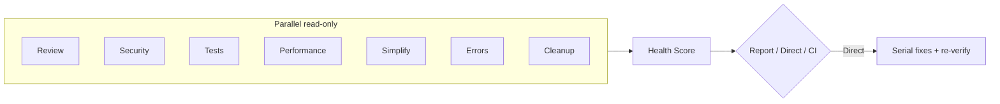

# Supercode

One-command post-coding pipeline for AI coding tools: **review, security, tests, performance, simplify, error-handling, cleanup** — with health scores, presets, CI gates, and cross-tool install.

Works with **Cursor**, **Claude Code**, **Qoder**, and **Trae**.

---

## What it does

Type `/supercode` after you finish coding. Supercode runs **7 parallel read-only analysis passes**, aggregates findings, computes a **health score (0–100)**, then either:

- **Report mode** — writes `docs/supercode/*.md` + `report.json`, waits for your confirmation before changing code
- **Direct mode** — applies fixes incrementally (Critical first), tests after each group, **re-scans** to show before→after scores
- **CI mode** — generates machine-readable report + exit code for GitHub Actions



---

## Commands

| Command | Purpose |
|---------|---------|
| `/supercode` | Full pipeline; asks Report vs Direct + scope |
| `/supercode-quick` | Review + security + errors on recent changes (High+) |
| `/supercode-deep` | All passes, whole project, benchmarks required |
| `/supercode-security` | Security + error-handling + dependency audit |
| `/supercode-pre-pr` | Pre-PR gate: recent changes, High+ must be clean |

Add `--ci` for CI mode (no prompts, writes JSON, runs gate).

---

## Health Score

Each category gets 0–100. Penalties per open finding:

| Severity | Penalty |
|----------|---------|
| Critical | -25 |
| High | -10 |
| Medium | -4 |
| Low | -1 |

Direct mode shows **before → after** in the summary.

---

## Install

### Quick install (pick your tool)

**Windows (PowerShell):**
```powershell
git clone https://github.com/whitequeen306/supercode.git
cd supercode
.\scripts\install.ps1 -Tool cursor    # or: claude | qoder | trae | all
```

**macOS / Linux:**
```bash
git clone https://github.com/whitequeen306/supercode.git
cd supercode
chmod +x scripts/install.sh
./scripts/install.sh cursor    # or: claude | qoder | trae | all
```

Restart your IDE, then type `/supercode`.

### Per-tool details

| Tool | Manifest | Install target | Docs |
|------|----------|----------------|------|
| **Cursor** | `.cursor-plugin/plugin.json` | `~/.cursor/{commands,agents,skills,rules}/` | below |
| **Claude Code** | `.claude-plugin/plugin.json` | `~/.claude/{commands,agents,skills}/` | below |
| **Qoder** | none (directory convention) | `~/.qoder/{commands,skills,rules}/` | [adapters/qoder](adapters/qoder/README.md) |
| **Trae** | none (`.trae/` directory) | `~/.trae/` or project `.trae/` | [adapters/trae](adapters/trae/README.md) |

#### Cursor (plugin install alternative)

```bash
# From repo root — if using Cursor plugin marketplace locally
cursor plugin install ./supercode
```

Or copy via script: `.\scripts\install-cursor.ps1`

#### Claude Code (plugin install alternative)

```bash
claude plugin marketplace add ./supercode/.claude-plugin/marketplace.json
claude plugin install supercode@supercode-marketplace
```

Or: `./scripts/install.sh claude`

---

## Project configuration

Copy examples into your project root:

```bash
cp supercode.config.example.json supercode.config.json
cp .supercodeignore.example .supercodeignore
```

### `supercode.config.json` (key fields)

```json
{
  "preset": "pre-pr",
  "scope": "recent",
  "severityFloor": "High",
  "ci": {
    "enabled": true,
    "sarif": true,
    "failOnCritical": true,
    "maxHigh": 0
  }
}
```

### Suppress false positives

**File-level** (`.supercodeignore`):
```
dist/
*.min.js
```

**Inline:**
```typescript
// supercode-ignore SC-042
legacyFallback();
```

---

## CI / GitHub Actions

Supercode writes `docs/supercode/report.json`. Gate with:

```bash
node scripts/ci-gate.mjs docs/supercode/report.json
```

| Exit code | Meaning |
|-----------|---------|
| `0` | Pass |
| `1` | Critical findings present |
| `2` | High findings exceed threshold |
| `3` | Report missing or invalid |

### Example workflow

```yaml
name: Supercode
on: [pull_request]

jobs:
  supercode:
    runs-on: ubuntu-latest
    steps:
      - uses: actions/checkout@v4
      - name: Run Supercode (via your AI CLI)
        run: |
          # Invoke your tool's CLI with /supercode-pre-pr --ci
          # Must produce docs/supercode/report.json
      - name: CI gate
        run: node scripts/ci-gate.mjs docs/supercode/report.json
```

> **Note:** The AI analysis step depends on your coding tool's CLI (Cursor, Claude Code, etc.). The `ci-gate.mjs` script is tool-agnostic and validates the report.

---

## Output artifacts

| File | Description |
|------|-------------|
| `docs/supercode/00-summary.md` | Overview + health scores |
| `docs/supercode/01-correctness.md` … `07-cleanup.md` | Per-category findings |
| `docs/supercode/report.json` | Machine-readable (schema in `schemas/`) |
| `docs/supercode/report.sarif` | SARIF for GitHub code scanning (optional) |

Each finding: `SC-001`, severity, category, location, problem, recommendation, auto-fixable.

---

## Repository structure

```
supercode/
├── commands/           # /supercode, /supercode-quick, ...
├── agents/             # code-reviewer, security-auditor, ...
├── skills/             # performance, simplify, security-review, ...
├── rules/              # workflow, refactor-safety, security-hardening
├── scripts/            # install.*, ci-gate.mjs
├── schemas/            # report JSON schema
├── adapters/           # Qoder & Trae install notes
├── .cursor-plugin/     # Cursor manifest
├── .claude-plugin/     # Claude Code manifest
├── AGENTS.md           # Cross-tool rules
└── supercode.config.example.json
```

---

## The 7 analysis passes

| Pass | Agent / Skill | Focus |
|------|---------------|-------|
| Review | `code-reviewer` | Correctness, readability, architecture |
| Security | `security-auditor` | OWASP, secrets, auth, injection |
| Tests | `test-engineer` | Coverage gaps, weak tests |
| Performance | `performance-optimization` | N+1, benchmarks, re-renders |
| Simplify | `code-simplifier` | Clarity without behavior change |
| Error handling | `silent-failure-hunter` | Silent failures, broad catch |
| Cleanup | `dead-code-and-deps` | Dead code, vulnerable deps |

**Analysis is parallel (read-only). Fixes are serial (with tests between groups).**

---

## Credits

- [superpowers](https://github.com/obra/superpowers) — plugin structure inspiration
- [Anthropic claude-plugins-official](https://github.com/anthropics/claude-plugins-official) — code-simplifier, silent-failure-hunter
- [performance-deity](https://github.com/v0idOS/performance-deity) — benchmark methodology (MIT)

---

## License

MIT — see [LICENSE](LICENSE)
