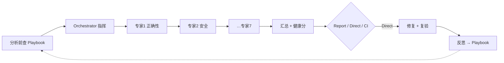
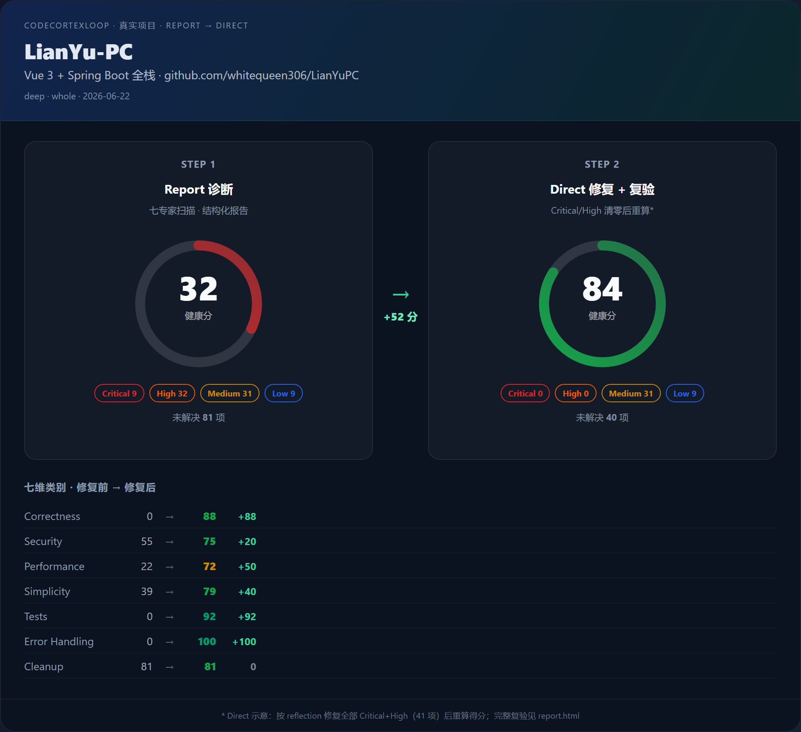
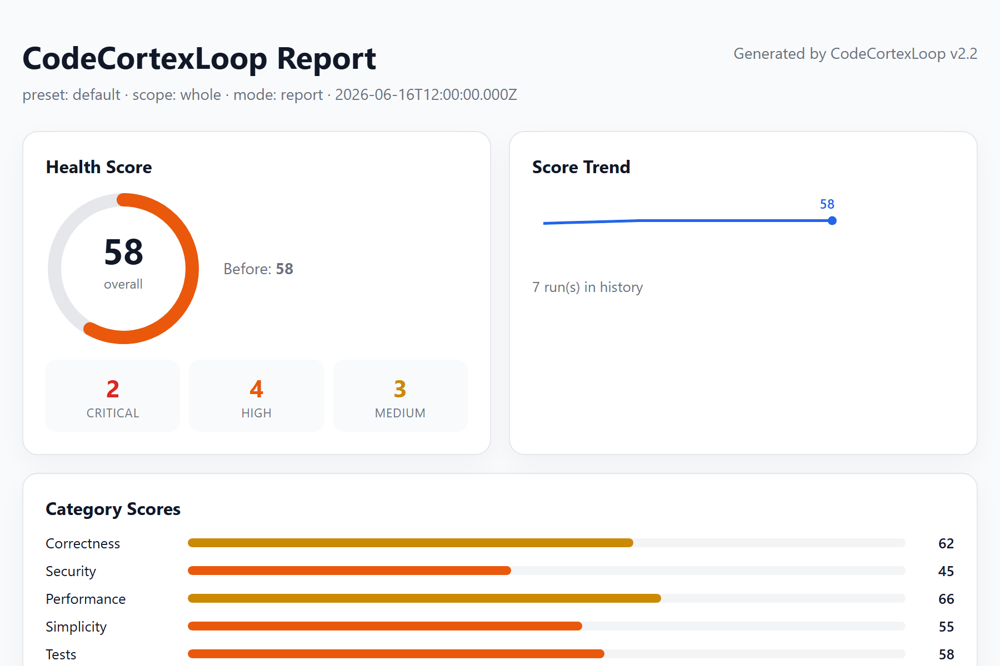

# CodeCortexLoop

**一条命令，七位领域专家，可自我进化的 Playbook。**

面向 AI 编码工具的「写完代码后」流水线：**正确性 → 安全 → 测试 → 错误处理 → 性能 → 精简 → 清理** —— 配套健康分、HTML 看板、handoff 接力、双语 Playbook、基线棘轮与 CI 集成。

[](examples/demo-app/docs/cortexloop/report.html)

## 核心能力

| 能力 | 说明 |
|------|------|
| **七专家串行** | Orchestrator 调度 7 个 Task，每人只负责本领域 |
| **健康分 0–100** | 七维打分 + 总分；Direct 模式输出 **修复前 → 修复后** |
| **三种模式** | Report（只诊断）· Direct（修复+复验）· CI（门禁） |
| **Playbook** | 项目内学习修复模式（候选/已验证，防幻觉） |
| **零依赖脚本** | 看板、徽章、history、ci-gate 纯 Node，无 npm 依赖 |

---

## 一键安装

```bash
curl -fsSL https://raw.githubusercontent.com/whitequeen306/code-cortex-loop/main/scripts/install-remote.sh | bash -s cursor
```

Windows（PowerShell）：

```powershell
irm https://raw.githubusercontent.com/whitequeen306/code-cortex-loop/main/scripts/install-remote.ps1 | iex; Install-CodeCortexLoop -Tool cursor
```

将 `cursor` 换成 `claude` | `qoder` | `trae` | `opencode` | `codex` | `all`。安装后**重启工具**，在聊天里输入 `/cortexloop`。

本地 clone 安装：

```powershell
git clone https://github.com/whitequeen306/code-cortex-loop.git
cd code-cortex-loop
.\scripts\install.ps1 -Tool cursor   # macOS/Linux: ./scripts/install.sh cursor
```

---

## 我适不适合用？（三个问题）

任意一条答 **否** → 大概率不需要（这很正常）：

| 问题 | 原因 |
|------|------|
| 你常用 **Cursor** 或 **Claude Code** 吗？ | 只有这两款有真正的 Task 子 agent 隔离；其它工具会退化为单会话 |
| 改动量 **≥ 几百行** 或是一个完整功能吗？ | 改个 typo 用 linter 就够了 |
| 能接受每次 **约 3–10 分钟** 跑完整流程吗？ | 见下方 [性能预算](#性能预算)；小 PR 用 `/cortexloop-quick` |

---

## 和现成方案比

| | CodeCortexLoop | CodeRabbit / Copilot Review | SonarQube / Snyk | 自己写 Cursor rules |
|--|----------------|----------------------------|------------------|---------------------|
| **跑在哪** | AI IDE 会话里 | 托管 PR 机器人 | CI / 服务端 | 你的聊天 |
| **多领域审查** | 7 路专家串行 | 单次 review | 规则扫描 | 看你怎么 prompt |
| **项目内学习** | Playbook（候选/已验证） | 产品记忆 | 基线/issue | 手动维护 |
| **成本** | 你的模型 token | 订阅 | 授权/云 | 写规则的时间 |
| **适合谁** | 已习惯 Cursor/Claude Agent 的开发者 | 零配置 PR review 的团队 | 合规/静态分析 | 爱折腾的人 |

**不是 SaaS**，是 **harness + 零依赖脚本**，让现有 AI 工具像一支有流程的审查团队。

---

## 怎么工作



- **Orchestrator**（主会话）：定 scope、按序启动 Task、汇总 handoff、打分；**禁止**自己 inline 做 pass 分析
- **领域专家**（每 pass 一个 Task）：只负责本领域，写类别报告 + handoff JSON，供下游专家阅读
- **分析串行、修复串行**（Direct 模式下每组修复后跑测试）

### 七专家固定顺序

| 步 | Pass | 专家 (Task) | 类别报告 | Handoff |
|----|------|-------------|----------|---------|
| 1 | `review` | `code-reviewer` | `01-correctness.md` | `.cortexloop/handoff/01-correctness.json` |
| 2 | `security` | `security-auditor` | `02-security.md` | `.cortexloop/handoff/02-security.json` |
| 3 | `tests` | `test-engineer` | `05-tests.md` | `.cortexloop/handoff/03-tests.json` |
| 4 | `errorHandling` | `silent-failure-hunter` | `06-error-handling.md` | `.cortexloop/handoff/04-error-handling.json` |
| 5 | `performance` | `performance-analyst` | `03-performance.md` | `.cortexloop/handoff/05-performance.json` |
| 6 | `simplicity` | `code-simplifier` | `04-simplicity.md` | `.cortexloop/handoff/06-simplicity.json` |
| 7 | `cleanup` | `cleanup-curator` | `07-cleanup.md` | `.cortexloop/handoff/07-cleanup.json` |

合约与边界：`passes/README.md` · Handoff Schema：`schemas/pass-handoff.schema.json`

---

## 三种工作模式

| 模式 | 触发 | 行为 |
|------|------|------|
| **Report** | `/cortexloop` 默认询问 | 写出报告 + 看板，**停下等你确认**再改代码 |
| **Direct** | 选择 Direct | 分组修复 → 每组跑测试 → **复验重跑七专家** → 输出修复前后得分 → 自动反思写入 Playbook |
| **CI** | `/cortexloop --ci` 或配置 `ci.enabled` | 无交互，写 `report.json`，跑 `ci-gate`，可选 PR 评论 |

---

## 命令一览

| 命令 | 用途 |
|------|------|
| `/cortexloop` | 完整 7 pass；询问 Report / Direct 与范围 |
| `/cortexloop-quick` | 3 pass：审查 + 安全 + 错误处理；适合小改动 |
| `/cortexloop-deep` | 7 pass 整库深扫 |
| `/cortexloop-security` | 安全 + 错误处理 + 依赖清理 |
| `/cortexloop-pre-pr` | PR 前：近期改动，High+ 须清零 |
| `/cortexloop-baseline` | 接受或对比技术债基线 |
| `/cortexloop-reflect` | 手动复盘并写入 Playbook |

---

## 跑完会得到什么

| 产物 | 路径 | 说明 |
|------|------|------|
| 概览 | `docs/cortexloop/00-summary.md` | 人类可读总结 + 健康分 |
| 分类报告 | `docs/cortexloop/01-*.md` … `07-*.md` | 各领域明细 |
| 机器报告 | `docs/cortexloop/report.json` | CI 门禁输入（须含 `"generatedBy":"cortexloop"`） |
| **HTML 看板** | `docs/cortexloop/report.html` | 浏览器直接打开，含分数环、类别条、问题表 |
| 运行统计 | `docs/cortexloop/run-summary.md` | pass 数、耗时、估算 token |
| Handoff | `.cortexloop/handoff/*.json` | 每 pass 结构化交接 |
| 趋势 / 徽章 | `.cortexloop/history.json`、`.cortexloop/health-badge.svg` | README 可嵌入徽章 |
| Playbook | `.cortexloop/playbook.json` | 英文，**仅模型 query** |
| Playbook 中文 | `.cortexloop/playbook-zh.md` | 人类阅读，模型不读 |
| 复盘 | `docs/cortexloop/08-reflection.md` | Direct 成功后自动生成 |

`report.json` 写出后自动跑后处理（badge、看板、历史、PR 评论体）。也可手动：

```bash
node scripts/validate-handoffs.mjs
node scripts/run-summary.mjs --out=docs/cortexloop/run-summary.md
node scripts/make-dashboard.mjs docs/cortexloop/report.json
```

---

## 健康分（0–100）

按**未解决**问题扣分，Direct 模式展示 **修复前 → 修复后**：

| 严重度 | 扣分 |
|--------|------|
| Critical | -25 |
| High | -10 |
| Medium | -4 |
| Low | -1 |

每条计入分数的 finding 须含 **Evidence + Confidence**；低置信猜测不进计分，只进 Open Questions。

---

## Playbook 自我进化

v2.2 核心：**记忆是召回（去哪查），不是权威（该信什么）** —— 命中只提示优先排查区，修法每次重新推导验证。

| 层级 | 含义 |
|------|------|
| **verified** | 多样且已验证，query 默认展示 |
| **candidate** | 未确认假设，禁止自动套用 |
| **quarantined** | 失败/过低置信，不展示 |

```bash
# 分析前（默认仅 verified）
node scripts/playbook.mjs query --category=security,errorHandling --lang=js --global-merge

# Direct 复验成功后
node scripts/playbook.mjs record .cortexloop/reflection.json

# CI/人工确认或负反馈
node scripts/playbook.mjs feedback --signature=<sig> --outcome=external_verified --evidence="ci: run 123"
```

详见 [docs/GUIDE.md#自我进化learning-loop](docs/GUIDE.md) 与 `rules/learning-loop.mdc`。

---

## 工具支持

| 工具 | 安装参数 | 配置目录 | Task 子 agent |
|------|----------|----------|---------------|
| **Cursor** | `cursor` | `~/.cursor/` | ✅ 完整 |
| **Claude Code** | `claude` | `~/.claude/` | ✅ 完整 |
| Qoder | `qoder` | `~/.qoder/` | ⚠️ 退化（单会话） |
| Trae | `trae` | `~/.trae/` | ⚠️ 退化 |
| OpenCode | `opencode` | `~/.config/opencode/` | ⚠️ 退化 |
| Codex | `codex` | `~/.codex/` | ⚠️ 退化（走 skills） |

非 Cursor/Claude 时会提示 `⚠️ Falling back to single-session mode`。各工具差异：[adapters/](adapters/)。

---

## 项目配置（可选）

```bash
cp cortexloop.config.example.json cortexloop.config.json
cp .cortexloopignore.example .cortexloopignore
```

`cortexloop.config.json` 可覆盖 preset、scope、启用哪些 pass、CI 阈值、Playbook 路径等。行内抑制：`// cortexloop-ignore CL-001`。

---

## CI / GitHub Actions

第 1 步：你的 AI 工具产出 `docs/cortexloop/report.json`（例如 `/cortexloop-pre-pr --ci`）。

第 2 步：仓库根目录的复合 Action：

```yaml
name: CodeCortexLoop
on: [pull_request]

jobs:
  gate:
    runs-on: ubuntu-latest
    permissions:
      contents: read
      pull-requests: write
    steps:
      - uses: actions/checkout@v4
      # - run: your-ai-cli /cortexloop-pre-pr --ci
      - uses: whitequeen306/code-cortex-loop@v2.2.0
        with:
          report-path: docs/cortexloop/report.json
          max-high: '0'
          comment: 'true'
```

老项目债太多？先 `/cortexloop-baseline` 接受基线，再 `ci-gate --baseline` 只拦**新增** Critical/High。完整示例：[.github/workflows/cortexloop-example.yml](.github/workflows/cortexloop-example.yml)。

---

## 真实项目案例：LianYu-PC

[](examples/lianyu-pc/docs/cortexloop/showcase.html)

在 **Vue 3 + Spring Boot 全栈项目**上跑 `/cortexloop-deep` **Report 模式**（2026-06-22，整库扫描）。上图展示 **Report 诊断 → Direct 修复示意** 的先后对比；完整 81 条明细见标准看板。

| 阶段 | 健康分 | Critical / High / Medium / Low | 说明 |
|------|--------|--------------------------------|------|
| **Report 诊断** | **32** | 9 / 32 / 31 / 9 | 真实扫描产物 |
| **Direct 示意*** | **84** | 0 / 0 / 31 / 9 | 按 reflection 清零 Critical+High（41 项）后重算 |

\* Direct 右侧为**示意得分**（非完整七专家复验）；LianYu-PC 原项目有 `08-reflection.md` 记录修复，完整复验待重跑。

**典型发现：** 验证码表达式泄露 · SSE 错误仍持久化 · 前端轮询静默失败 · 认证/SSE 核心路径零测试

| 链接 | 说明 |
|------|------|
| [showcase.html](examples/lianyu-pc/docs/cortexloop/showcase.html) | **Report → Direct 对比看板**（上图来源） |
| [report.html](examples/lianyu-pc/docs/cortexloop/report.html) | 标准看板（含全部 finding 表） |
| [00-summary.md](examples/lianyu-pc/docs/cortexloop/00-summary.md) | 人类可读摘要 |
| [examples/lianyu-pc/](examples/lianyu-pc/) | 案例目录说明 |

> 产物为 Report 模式拷贝，**不含** LianYu-PC 源码，**未修改**原项目。  
> **想查看此项目：** [github.com/whitequeen306/LianYuPC](https://github.com/whitequeen306/LianYuPC)

### 教学用 Demo

[examples/demo-app/](examples/demo-app/) — 故意写满 bug 的小项目，适合第一次试 `/cortexloop`。

---

## 性能预算

| 模式 | Pass 数 | 预估耗时* | 预估 token* |
|------|---------|-----------|-------------|
| `/cortexloop-quick` | 3 | ~2–4 分钟 | ~8万–15万 |
| `/cortexloop` | 7 | ~5–12 分钟 | ~20万–45万 |
| `/cortexloop-deep` | 7 + 整库 | ~10–25 分钟 | ~40万–90万 |

\* 约 500 行 scope、Cursor/Claude；[详细方法 →](docs/PERFORMANCE.md)

后处理脚本（badge/看板/历史）：中位数 **~416ms**（实测，无 LLM）。

---

## 文档索引

| 文档 | 内容 |
|------|------|
| [docs/GUIDE.md](docs/GUIDE.md) | **完整指南（中文）**：基线棘轮、后处理、适配器、致谢 |
| [docs/PERFORMANCE.md](docs/PERFORMANCE.md) | 性能预算与测量 |
| [docs/LAUNCH-zh.md](docs/LAUNCH-zh.md) | 推广文案 |
| [passes/README.md](passes/README.md) | 七专家合约 |
| [CONTRIBUTING.md](CONTRIBUTING.md) | 参与贡献 |
| [CHANGELOG.md](CHANGELOG.md) | 版本历史 |

<details>
<summary>可选：demo 动画 GIF</summary>



</details>

---

## 仓库结构

```
commands/     # /cortexloop 系列 slash command
passes/       # 七专家串行合约
agents/       # 领域专家 persona
skills/       # 深度 skill + reflect
rules/        # workflow、learning-loop、refactor-safety …
scripts/      # ci-gate、playbook、看板、showcase、安装脚本（零 npm 依赖）
schemas/      # report、config、handoff JSON schema
examples/     # demo-app + lianyu-pc（真实大项目 Report）
action.yml    # GitHub 复合 Action
```

---

## 许可证

MIT —— 见 [LICENSE](LICENSE)
