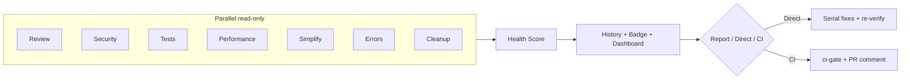
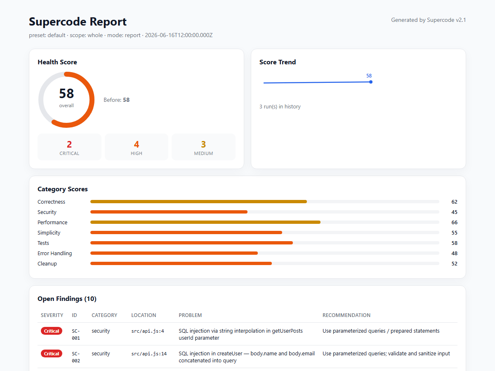

# Supercode


One-command post-coding pipeline for AI coding tools: **review, security, tests, performance, simplify, error-handling, cleanup** — with health scores, **trend history**, **visual dashboard**, **baseline ratchet**, and **GitHub Action**.

Works with **Cursor**, **Claude Code**, **Qoder**, and **Trae**.

---

## What it does

Type `/supercode` after you finish coding. Supercode runs **7 parallel read-only analysis passes**, aggregates findings, computes a **health score (0–100)**, then either:

- **Report mode** — writes `docs/supercode/*.md` + `report.json` + **HTML dashboard**, waits for your confirmation
- **Direct mode** — applies fixes incrementally, **re-scans**, shows before→after scores + trend
- **CI mode** — machine-readable report + exit code + optional PR comment



---

## Output preview

After `/supercode`, you get **visual reports** — not just text files in a folder.

### HTML dashboard (`report.html`)

Self-contained page generated by `make-dashboard.mjs`. Open in any browser — no server needed.

[](examples/demo-app/docs/supercode/report.html)

| Panel | What it shows |
|-------|----------------|
| **Health Score** | Overall 0–100 ring + Critical / High / Medium counts |
| **Score Trend** | Sparkline from `.supercode/history.json` (improves after Direct mode fixes) |
| **Category Scores** | 7 bars: Correctness, Security, Performance, Simplicity, Tests, Error Handling, Cleanup |
| **Open Findings** | Sortable table — severity badge, `SC-###` ID, location, problem, recommendation |

**Try it:** clone the repo and open [examples/demo-app/docs/supercode/report.html](examples/demo-app/docs/supercode/report.html)

### README badge (`health-badge.svg`)

Embed in your repo README — updates every run:

```markdown

```

Current demo score: **58/100** (see badge at top of this page).

### PR comment (GitHub)

In CI, Supercode posts a summary comment on pull requests:

| Severity | Count |
|----------|------:|
| Critical | 2 |
| High | 4 |
| Medium | 3 |

Plus category score table, top findings list, and links to the full dashboard. See [demo PR comment body](examples/demo-app/.supercode/pr-comment.md).

### Markdown + JSON reports

| File | Format | Use |
|------|--------|-----|
| `docs/supercode/00-summary.md` | Markdown | Human-readable overview |
| `docs/supercode/01-correctness.md` … `07-cleanup.md` | Markdown | Per-category detail |
| `docs/supercode/report.json` | JSON | CI gate, scripts, integrations |
| `docs/supercode/report.html` | HTML | Visual dashboard (above) |

Sample machine report: [examples/demo-app/docs/supercode/report.json](examples/demo-app/docs/supercode/report.json)

---

## v2.1 Highlights

| Feature | What you get |
|---------|----------------|
| **Score trend** | `.supercode/history.json` — watch your codebase improve run over run |
| **Visual dashboard** | `docs/supercode/report.html` — self-contained HTML, screenshot-ready |
| **README badge** | `.supercode/health-badge.svg` — embed in your repo |
| **Baseline ratchet** | `/supercode-baseline` — legacy debt accepted; CI fails only on **new** issues |
| **GitHub Action** | `action.yml` — gate + badge + dashboard + PR comment in one step |
| **Demo app** | [examples/demo-app](examples/demo-app) — bug garden + pre-generated outputs |

> **Live preview:** [report.html](examples/demo-app/docs/supercode/report.html) · [dashboard screenshot](examples/demo-app/docs/supercode/report-dashboard.png)

---

## Commands

| Command | Purpose |
|---------|---------|
| `/supercode` | Full pipeline; asks Report vs Direct + scope |
| `/supercode-quick` | Review + security + errors on recent changes (High+) |
| `/supercode-deep` | All passes, whole project, benchmarks required |
| `/supercode-security` | Security + error-handling + dependency audit |
| `/supercode-pre-pr` | Pre-PR gate: recent changes, High+ must be clean |
| `/supercode-baseline` | Accept or diff technical debt baseline |

Add `--ci` for CI mode (no prompts, writes JSON, runs gate).

---

## Health Score

Each category gets 0–100. Penalties per open finding:

| Severity | Penalty |
|----------|---------|
| Critical | -25 |
| High | -10 |
| Medium | -4 |
| Low | -1 |

Direct mode shows **before → after** in the summary. History tracks trends across runs.

---

## Post-processing scripts

After `report.json` is written, run (zero npm dependencies):

```bash
node scripts/record-history.mjs docs/supercode/report.json
node scripts/make-badge.mjs docs/supercode/report.json
node scripts/make-dashboard.mjs docs/supercode/report.json
node scripts/pr-comment.mjs docs/supercode/report.json
```

`/supercode` runs these automatically when configured (default: enabled).

---

## Baseline ratchet (legacy codebases)

Too many existing issues? Accept current debt once:

```bash
/supercode-baseline   # or:
node scripts/baseline.mjs accept docs/supercode/report.json
```

On every PR after that:

```bash
node scripts/baseline.mjs diff docs/supercode/report.json
node scripts/ci-gate.mjs docs/supercode/report.json --baseline
```

Only **new** Critical/High findings fail CI. Fixed issues show as progress.

---

## Install

### Quick install (pick your tool)

**Windows (PowerShell):**
```powershell
git clone https://github.com/whitequeen306/supercode.git
cd supercode
.\scripts\install.ps1 -Tool cursor    # or: claude | qoder | trae | all
```

**macOS / Linux:**
```bash
git clone https://github.com/whitequeen306/supercode.git
cd supercode
chmod +x scripts/install.sh
./scripts/install.sh cursor    # or: claude | qoder | trae | all
```

Restart your IDE, then type `/supercode`.

### Per-tool details

| Tool | Manifest | Install target | Docs |
|------|----------|----------------|------|
| **Cursor** | `.cursor-plugin/plugin.json` | `~/.cursor/{commands,agents,skills,rules}/` | below |
| **Claude Code** | `.claude-plugin/plugin.json` | `~/.claude/{commands,agents,skills}/` | below |
| **Qoder** | none (directory convention) | `~/.qoder/{commands,skills,rules}/` | [adapters/qoder](adapters/qoder/README.md) |
| **Trae** | none (`.trae/` directory) | `~/.trae/` or project `.trae/` | [adapters/trae](adapters/trae/README.md) |

---

## Project configuration

Copy examples into your project root:

```bash
cp supercode.config.example.json supercode.config.json
cp .supercodeignore.example .supercodeignore
```

### `supercode.config.json` (key fields)

```json
{
  "preset": "pre-pr",
  "scope": "recent",
  "severityFloor": "High",
  "ci": {
    "enabled": true,
    "sarif": true,
    "failOnCritical": true,
    "maxHigh": 0,
    "baseline": false
  },
  "history": { "enabled": true },
  "badge": { "enabled": true },
  "dashboard": { "enabled": true },
  "baseline": { "enabled": false }
}
```

### Suppress false positives

**File-level** (`.supercodeignore`):
```
dist/
*.min.js
```

**Inline:**
```typescript
// supercode-ignore SC-042
legacyFallback();
```

---

## CI / GitHub Actions

Supercode ships a **composite GitHub Action** at repo root (`action.yml`).

### Minimal workflow

```yaml
name: Supercode
on: [pull_request]

jobs:
  supercode:
    runs-on: ubuntu-latest
    permissions:
      contents: read
      pull-requests: write
    steps:
      - uses: actions/checkout@v4

      # Step 1: Your AI tool produces report.json
      # - run: your-ai-cli /supercode-pre-pr --ci

      # Step 2: Gate + badge + dashboard + PR comment
      - uses: whitequeen306/supercode@v2.1.0
        with:
          report-path: docs/supercode/report.json
          max-high: '0'
          baseline: 'false'
          comment: 'true'
```

See [.github/workflows/supercode-example.yml](.github/workflows/supercode-example.yml) for a full example.

### Manual gate

```bash
node scripts/ci-gate.mjs docs/supercode/report.json
node scripts/ci-gate.mjs docs/supercode/report.json --baseline   # ratchet mode
```

| Exit code | Meaning |
|-----------|---------|
| `0` | Pass |
| `1` | Critical findings present |
| `2` | High findings exceed threshold |
| `3` | Report missing or invalid |

---

## Output artifacts

| File | Description |
|------|-------------|
| `docs/supercode/00-summary.md` | Overview + health scores |
| `docs/supercode/01-correctness.md` … `07-cleanup.md` | Per-category findings |
| `docs/supercode/report.json` | Machine-readable (schema in `schemas/`) |
| `docs/supercode/report.html` | **Visual dashboard** (v2.1) |
| `docs/supercode/report.sarif` | SARIF for GitHub code scanning (optional) |
| `.supercode/history.json` | Score trend history |
| `.supercode/health-badge.svg` | README badge |
| `.supercode/baseline.json` | Accepted debt snapshot |
| `.supercode/pr-comment.md` | GitHub PR comment body |

Each finding: `SC-001`, severity, category, location, problem, recommendation, auto-fixable.

---

## Demo walkthrough

See [examples/README.md](examples/README.md) — includes a deliberately flawed app and pre-generated dashboard/badge/history.

```bash
cd examples/demo-app
# Open docs/supercode/report.html in your browser
/supercode    # run with your AI tool
```

---

## Repository structure

```
supercode/
├── commands/           # /supercode, /supercode-quick, /supercode-baseline, ...
├── agents/             # code-reviewer, security-auditor, ...
├── skills/             # performance, simplify, security-review, ...
├── rules/              # workflow, refactor-safety, baseline-policy, ...
├── scripts/            # install.*, ci-gate, baseline, make-dashboard, ...
├── schemas/            # report + config JSON schemas
├── examples/           # demo app + walkthrough
├── action.yml          # GitHub composite action
├── adapters/           # Qoder & Trae install notes
├── .cursor-plugin/     # Cursor manifest
├── .claude-plugin/     # Claude Code manifest
├── AGENTS.md           # Cross-tool rules
└── supercode.config.example.json
```

---

## The 7 analysis passes

| Pass | Agent / Skill | Focus |
|------|---------------|-------|
| Review | `code-reviewer` | Correctness, readability, architecture |
| Security | `security-auditor` | OWASP, secrets, auth, injection |
| Tests | `test-engineer` | Coverage gaps, weak tests |
| Performance | `performance-optimization` | N+1, benchmarks, re-renders |
| Simplify | `code-simplifier` | Clarity without behavior change |
| Error handling | `silent-failure-hunter` | Silent failures, broad catch |
| Cleanup | `dead-code-and-deps` | Dead code, vulnerable deps |

**Analysis is parallel (read-only). Fixes are serial (with tests between groups).**

---

## Credits

- [superpowers](https://github.com/obra/superpowers) — plugin structure inspiration
- [Anthropic claude-plugins-official](https://github.com/anthropics/claude-plugins-official) — code-simplifier, silent-failure-hunter
- [performance-deity](https://github.com/v0idOS/performance-deity) — benchmark methodology (MIT)

---

## License

MIT — see [LICENSE](LICENSE)
