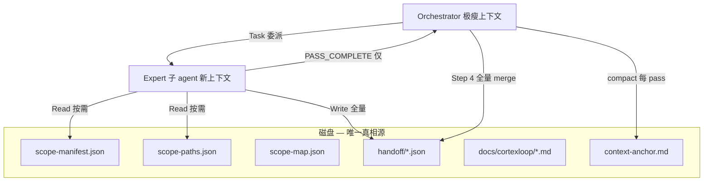

# CodeCortexLoop — 完整指南

面向已安装用户的详细说明。快速判断与安装见 [README](../README.md)。

---

## 核心能力

| 能力 | 说明 |
|------|------|
| **七专家串行协作** | `/cortexloop` 按固定顺序启动 7 个领域专家（Task 子 agent），每人只负责本领域；orchestrator 只调度与汇总，不 inline 分析 |
| **健康分（0–100）** | 按类别打分 + 总分，Direct 修复后给出 **修复前 → 修复后** 对比 |
| **可自我进化** | 内置 **Playbook 记忆库**（防幻觉信任模型：候选/已验证、负信号、外部预言机优先） |
| **可视化看板** | 自包含的 `report.html`，浏览器直接打开 |
| **趋势 + 徽章** | `history.json` 记录历次得分趋势 |
| **基线棘轮** | 老项目历史欠债一次性接受，CI 只对**新增**问题报错 |
| **CI / GitHub Action** | 内置复合 Action |
| **CI/安装零额外依赖** | 后处理脚本仅需 Node，不在用户项目 `npm install` |

## 工作模式

- **Report 模式** —— 写出报告 + handoff + 看板，停下等你确认
- **Direct 模式** —— 选择修复下限（**High+** 默认 / **Medium+** / **含 Low 全量**）→ 分组增量修复、复验时重跑七专家管道，自动反思沉淀
- **CI 模式** —— 机器可读报告 + 退出码 + 可选 PR 评论

### Direct 修复下限（`direct.fixFloor`）

与 `severityFloor`（报告阶段）不同，控制 **Direct 自动改代码** 的范围：

| 选项 | fixFloor | 自动修复 |
|------|----------|----------|
| A（默认） | `High` | Critical + High |
| B | `Medium` | + Medium |
| C | `Low` | + Low（Info 永不自动修） |

配置：`cortexloop.config.json` → `"direct": { "fixFloor": "High" }`。CLI：`--fix-floor=Medium`。

## 工具支持与退化模式

| 工具 | 子 agent | 体验 |
|------|----------|------|
| **Cursor** | Task 工具 | 7 个独立 Task 串行，领域隔离（**一等公民**） |
| **Claude Code** | Task / 子 agent | 同上（**一等公民**） |
| **OpenCode** | **Task 工具** + subagent | 与 Cursor 同流程（**一等公民**） |
| **Qoder** | **Agent 工具** + `~/.qoder/agents/` | 社区/实验性 |
| **Trae** | **SOLO 模式** + 自定义智能体 | 社区/实验性 |
| **Codex** | **显式 spawn** + `~/.codex/agents/*.toml` | 社区/实验性 |

Orchestrator 分支：Cursor/Claude/OpenCode → Task；Qoder → Agent；Trae → SOLO；Codex → spawn；未知工具 → fallback。

Trae / Qoder / OpenCode / Codex 详情：[adapters/trae/README.md](../adapters/trae/README.md) · [adapters/qoder/README.md](../adapters/qoder/README.md) · [adapters/opencode/README.md](../adapters/opencode/README.md) · [adapters/codex/README.md](../adapters/codex/README.md)

> **ZCode**（智谱 Z.ai ADE）为独立产品，当前未适配。

## 命令

| 命令 | 用途 |
|------|------|
| `/cortexloop` | 智能入口：询问模式和范围，预检风险并推荐 Lite / Standard / Full |
| `/cortexloop-lite` | 低成本：专家 1+2+4（审查 + 安全 + 错误处理） |
| `/cortexloop-standard` | 标准 PR 审查：专家 1+2+3+4（审查 + 安全 + 测试 + 错误处理） |
| `/cortexloop-full` | 完整 7 专家流水线 |
| `/cortexloop-security` | 安全 + 错误处理 + 依赖清理 |
| `/cortexloop-pre-pr` | PR 前门禁 |

高级命令：

| 命令 | 用途 |
|------|------|
| `/cortexloop-baseline` | 接受或对比技术债基线 |
| `/cortexloop-reflect` | 手动反思并写入 Playbook |

兼容别名：`/cortexloop-quick` → `/cortexloop-lite`，`/cortexloop-deep` → `/cortexloop-full`。

## 七专家串行协作

| 步 | Pass | 专家 (Task) | Handoff |
|----|------|-------------|---------|
| 1 | `review` | `code-reviewer` | `.cortexloop/handoff/01-correctness.json` |
| 2 | `security` | `security-auditor` | `.cortexloop/handoff/02-security.json` |
| 3 | `tests` | `test-engineer` | `.cortexloop/handoff/03-tests.json` |
| 4 | `errorHandling` | `silent-failure-hunter` | `.cortexloop/handoff/04-error-handling.json` |
| 5 | `performance` | `performance-analyst` | `.cortexloop/handoff/05-performance.json` |
| 6 | `simplicity` | `code-simplifier` | `.cortexloop/handoff/06-simplicity.json` |
| 7 | `cleanup` | `cleanup-curator` | `.cortexloop/handoff/07-cleanup.json` |

Schema：`schemas/pass-handoff.schema.json`。合约：`passes/README.md`。

## 自我进化（Learning Loop）

详见 README 链接与 `rules/learning-loop.mdc`。核心：**召回而非权威** —— 命中只提示优先排查区，修法每次重新推导验证。

```bash
node scripts/playbook.mjs query --category=performance,simplicity,errorHandling --lang=js
node scripts/playbook.mjs record .cortexloop/reflection.json
node scripts/playbook.mjs feedback --signature=<sig> --outcome=external_verified
```

## 健康分

| 严重度 | 扣分 |
|--------|------|
| Critical | -25 |
| High | -10 |
| Medium | -4 |
| Low | -1 |

## 后处理脚本

```bash
node scripts/validate-handoffs.mjs          # fail-fast if handoffs missing/invalid
node scripts/run-summary.mjs                # pass count, duration, est. tokens
node scripts/record-history.mjs docs/cortexloop/report.json
node scripts/make-badge.mjs docs/cortexloop/report.json
node scripts/make-dashboard.mjs docs/cortexloop/report.json
node scripts/pr-comment.mjs docs/cortexloop/report.json
```

## 基线棘轮

```bash
node scripts/baseline.mjs accept docs/cortexloop/report.json
node scripts/baseline.mjs diff docs/cortexloop/report.json
node scripts/ci-gate.mjs docs/cortexloop/report.json --baseline
```

## 项目配置

```bash
cp cortexloop.config.minimal.json cortexloop.config.json
cp .cortexloopignore.example .cortexloopignore
```

全量高级项见 [cortexloop.config.example.json](../cortexloop.config.example.json)（`mapWeights`、`learning.prune`、`crossValidation` 等）。

## CI / GitHub Actions

```yaml
- uses: whitequeen306/code-cortex-loop@v2.2.0
  with:
    report-path: docs/cortexloop/report.json
    max-high: '0'
```

完整示例：[.github/workflows/cortexloop-example.yml](../.github/workflows/cortexloop-example.yml)

## 各工具安装路径

| 工具 | 配置目录 |
|------|----------|
| Cursor | `~/.cursor/` |
| Claude Code | `~/.claude/` |
| Qoder | `~/.qoder/` |
| Trae | `~/.trae/` |
| OpenCode | `~/.config/opencode/` |
| Codex | `~/.codex/` |

各工具差异见 [adapters/](../adapters/)。

## 输出产物

| 文件 | 说明 |
|------|------|
| `docs/cortexloop/report.json` | 机器可读 |
| `docs/cortexloop/report.html` | 可视化看板 |
| `docs/cortexloop/run-summary.md` | 本次运行统计 |
| `.cortexloop/handoff/*.json` | 七专家 handoff |
| `.cortexloop/playbook.json` | 英文 Playbook（模型） |
| `.cortexloop/playbook-zh.md` | 中文 Playbook（人类） |

## Demo 与真实案例

- [examples/demo-app](../examples/demo-app/) — 故意写满 bug 的学习样例
- [examples/lianyu-pc](../examples/lianyu-pc/) — **真实大项目** LianYu-PC Report（Vue + Spring Boot）

## 性能预算

见 [PERFORMANCE.md](PERFORMANCE.md)。

## 大项目上下文工程

> 借鉴 SWE-Agent 长程上下文管理、CodeDelegator 角色分离、Magistrate/RepoReviewer 分层审查、Cursor Subagents 隔离上下文等思路，解决 **「Pass 1 跑完、Pass 2 起不来」** 的真实痛点——不是压缩分析质量，而是让 orchestrator **永远保持瘦身**。

**小项目无感：** scope 不足约 100 文件时不会触发 MAP；以下机制在大仓库或长会话断链时自动生效。

### 要解决的难题

| 症状 | 根因 |
|------|------|
| Pass 1 完成后主会话说「启动 Pass 2」却不 Task | orchestrator 上下文被 Pass 1 全文撑爆 |
| 607 个文件 inline 进 prompt | scope 列表占满 token，调度层先于分析层崩溃 |
| 用户发「继续」后长时间无响应 | 接近满的上下文 + 二次规划 → Cursor 超时 |

**旧模式**：聊天窗口 = 接力总线 → 大项目必断。  
**新模式**：**磁盘 = 接力总线**，聊天窗口只做调度。

### 借鉴的方法 → CodeCortexLoop 落地

| 思路 | 业界参考 | 我们怎么做 |
|------|----------|------------|
| **Thin Orchestrator** | CodeDelegator、agent-review-orchestrator | 主会话只读 anchor/summary；禁止粘贴专家报告 |
| **Artifact-driven Handoff** | Cursor Subagents 文档 | 全量 handoff/report 落盘；orchestrator 只收 `PASS_COMPLETE` |
| **On-demand Retrieval** | Claude Code、Confucius SDK | `scope-manifest.json` + `scope-paths.json`；专家 grep/codegraph 按需读 |
| **Map → Depth** | Magistrate、RepoReviewer、LLM Map-Reduce | `fileCount > 100` 先 **CortexScope Index** 确定性 map，再 7 pass 定点深扫 |
| **Structured Compaction** | CAT (ACL 2026 Findings)、Zylos Research | 每 pass 后写 `context-anchor.md` + `handoff-summary.json` |

### 架构：磁盘即接力总线



### 相关脚本（CI/安装零额外依赖，仅需 Node）

```bash
node scripts/build-scope-manifest.mjs --mode=whole    # scope 落盘 + 大 scope 自动 scope-map
node scripts/build-scope-map.mjs                        # 单独跑 CortexScope Index MAP
node scripts/compact-context.mjs --init --mode=direct   # 初始化 context anchor
node scripts/handoff-summary.mjs --through=3            # 压缩摘要给 orchestrator
node scripts/compact-context.mjs --pass=3 --next-pass=4 # 每 pass 后结构化压缩
```

### CortexScope Index（MAP 专用轻量索引）

| 信号 | 作用 |
|------|------|
| Git churn | 近期改动文件/目录加权 |
| Regex import 图 | 找高扇入 hub 文件 |
| 入口启发式 | main/index/Controller/IPC 等 |
| Pass 分桶 pattern | security/errorHandling 等关键词强制 mustReview |

**与 codegraph MCP 的关系**：互补非替代。CortexScope Index 负责 MAP 阶段秒级出图（**L1**）；`indexStrategy.optionalDeepIndex` 在大 scope / 低置信度时**建议**（非必须）用 codegraph 深挖调用链。

**防遗漏**：MAP 是**优先级排序**不是范围裁剪。`scope-paths.json` 仍含全量路径；`mustReview` + `longTailSample` 强制专家扫非 hotspot 区域。

#### 三层索引：L0 / L1 / codegraph

| 层 | 是什么 | 自带 |
|----|--------|------|
| **L0** | `scope-paths.json` + grep | 永远有 |
| **L1** | `scope-map.json` 热点地图 | 大项目（>100 文件）自动 |
| **codegraph** | 函数级调用链 | 可选，用户同意才装 |

**何时建议 codegraph**：文件数 ≥ 300、L1 置信度 < 0.7、或 `mapEnrichRecommended`；用户拒绝后仍保留 L1，仅损失调用链精度。

### 质量不会降的原因

- **压缩的是 orchestrator 聊天上下文**，不是 expert 分析证据链
- 7 个专家仍在**独立子上下文**中读完整 prior handoffs + 按需拉代码
- Step 4 由 `aggregate-findings.mjs` 机器化合并去重
- Step 3.5 跨 pass defer 回收机制不变（`lite` preset 可关闭）

大 scope trade-off：**非 hotspot 区域深度降低**（非消失）——`longTailSample` + `mustReview` 缓解；小 scope（<100 文件）不触发 Map。

## 致谢

- [superpowers](https://github.com/obra/superpowers)
- [Anthropic claude-plugins-official](https://github.com/anthropics/claude-plugins-official)
- [performance-deity](https://github.com/v0idOS/performance-deity)
